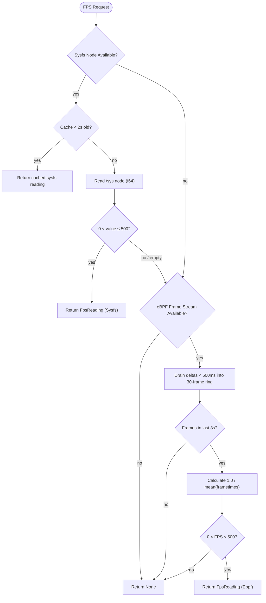

# FPS Detection

Auriya reports a frames-per-second value in daemon status and, when Frame-Aware
Scheduling is active, feeds frame data to the scheduler. FPS **observation** and
FAS **control** are separate: this page covers observation
(`src/core/fps_meter/mod.rs`); FAS is documented in
[Kala eBPF frame probe](kala-research) and [Profile scheduler](profile-scheduler).

:::info Verified against source
Traced to Auriya commit
[`10fe7c6`](https://github.com/pavelc4/auriya/tree/10fe7c6b56474a00513fec34ebac1376b30e95e6),
[`src/core/fps_meter/mod.rs`](https://github.com/pavelc4/auriya/blob/10fe7c6b56474a00513fec34ebac1376b30e95e6/src/core/fps_meter/mod.rs).
:::

## Two sources, sysfs first

`FpsMeter::read` tries **sysfs**, and only falls back to **eBPF** frame deltas if
sysfs yields nothing (`fps_meter/mod.rs`, `read()`). Sysfs is preferred because it
reports the actual display-measured refresh, which is steadier than per-frame
deltas under triple-buffering or vsync lock (module doc comment).

Every reading carries its origin so consumers can tell them apart:

```rust
pub enum FpsSource { Ebpf, Sysfs }
pub struct FpsReading { pub fps: f64, pub source: FpsSource }
```



In `STATUS` this surfaces as `FPS=<value> SOURCE=<ebpf|sysfs>` (see
[IPC protocol → STATUS](ipc-protocol#status-response)).

## Sysfs source

At construction, `detect_sysfs()` probes this ordered list and picks the **first**
path that exists and is non-empty (`FPS_SYSFS_PATHS`, `fps_meter/mod.rs`):

```text
/sys/class/drm/sde-crtc-0/measured_fps
/sys/class/drm/card0/sde-crtc-0/measured_fps
/sys/class/drm/card0/sde_crtc_fps
/sys/class/drm/card0/fbc/fps
/sys/class/graphics/fb0/measured_fps
/sys/class/graphics/fb0/fps
/sys/kernel/debug/mali/fps
/sys/class/misc/mali0/device/fps
```

The first six are Qualcomm/DRM display-controller and framebuffer nodes; the last
two are Mali (ARM GPU) nodes. If none qualify, there is no sysfs source and the
meter relies on eBPF only.

Behavior (`read_sysfs`):

- Polled at most once every **2 seconds** (`SYSFS_POLL_INTERVAL`); between polls
  the last reading is returned from cache.
- The file is parsed as `f64`; values outside `(0, 500]` are rejected (returns
  `None`), guarding against garbage or a `0` reading when the panel is idle.

## eBPF fallback

Used only when sysfs produced nothing. Frame durations arrive over a
`broadcast::Receiver<Duration>` from the Kala frame stream (see
[Kala eBPF frame probe → Auriya integration](kala-research#auriya-integration)).
`drain_ebpf` + `read` (`fps_meter/mod.rs`):

- Each incoming delta is kept only if **< 500 ms** (`Duration::from_millis(500)`);
  larger gaps (app not rendering) are dropped.
- Kept deltas fill a **30-frame** ring (`SHORT_WINDOW`, ≈ ½ s at 60 fps); FPS is
  `1.0 / mean(frametimes)`.
- If no frame has arrived for **3 seconds** (`ebpf_timeout`), or the ring is
  empty, `read` returns `None`.
- The computed FPS is subject to the same `(0, 500]` sanity clamp.
- A lagged broadcast (`TryRecvError::Lagged`) is logged and skipped; a closed
  channel disables the eBPF source for the rest of the meter's life.

## Consequences

- **FAS availability does not gate status FPS.** Even when the eBPF program
  cannot attach (old kernel, missing symbols), sysfs FPS still populates status.
- The meter never blocks: sysfs is cache-throttled, eBPF is drained
  non-blocking. A tick that finds neither source simply reports no FPS.
- The eBPF value here is a **frame-submission** rate derived from `queueBuffer`
  deltas, not a display-present timestamp — see the limitations in
  [Kala eBPF frame probe → Scope and limitations](kala-research#scope-and-limitations).

## Likely to drift first

`FPS_SYSFS_PATHS` (device-specific), the 2 s / 3 s / 500 ms / 30-frame constants,
and the `(0, 500]` clamp. Re-verify against `src/core/fps_meter/mod.rs`.
