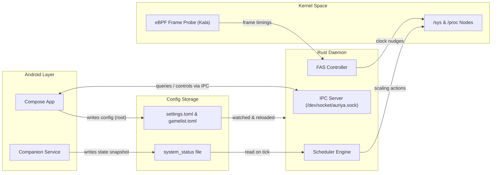

# Alur Data

Halaman ini mendokumentasikan bagaimana informasi, perintah, dan telemetri mengalir di antara komponen Auriya.

## Diagram Alur End-to-End {#end-to-end-everything-running}

## Urutan Boot (Boot Sequence) {#boot-sequence-cold-start--first-tick}

1. **Android Boot Completed (`sys.boot_completed = 1`)**: Script `module/service.sh` dipicu oleh root manager.
2. **Pembersihan State Lama**: Menghentikan proses lama yang tersisa dan menghapus socket lama di `/dev/socket/auriya.sock`.
3. **Meluncurkan Companion**: Menjalankan `dev.auriya.service.Main` via `app_process`.
4. **Menunggu Status Awal**: Menunggu hingga `/data/adb/.config/auriya/system_status` terisi (maksimal 10 detik).
5. **Eksekusi Daemon**: Menjalankan binary Rust `auriya` dengan parameter path konfigurasi.
6. **Inisialisasi Daemon**:
   - Memuat `settings.toml` dan `gamelist.toml`.
   - Mengikat socket `/dev/socket/auriya.sock`.
   - Menjalankan satu tick inisialisasi awal untuk menerapkan profil default.
   - Memasuki event loop Tokio.

## Alur Konfigurasi & Perintah Aplikasi {#app-configuration-flow}

- **Pengubahan Konfigurasi**: Aplikasi manajer langsung menulis perubahan ke file TOML di bawah `/data/adb/.config/auriya/`. File watcher di daemon mendeteksi modifikasi dan memperbarui status secara otomatis.
- **Perintah Langsung**: Untuk aksi cepat (seperti beralih mode manual atau reload), aplikasi berkomunikasi melalui Unix domain socket menggunakan protokol serialisasi teks baris.
