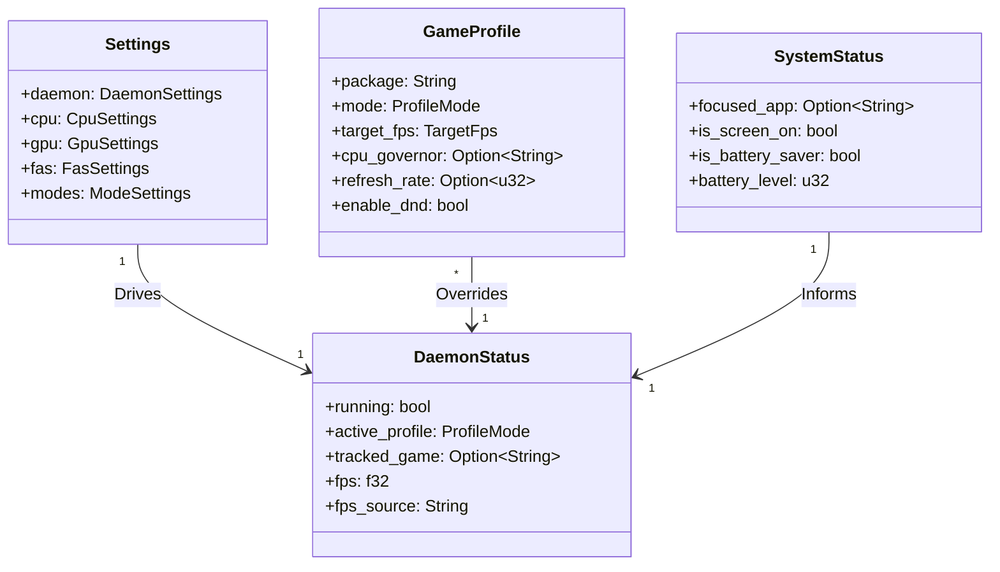

# Model Data

Halaman ini memetakan entitas data, kepemilikan, dan arah sinkronisasi antara komponen Rust dan Kotlin di Auriya.

## Peta Entitas Data {#entity-map-who-owns-what-sync-direction}

## Entitas Konfigurasi (Rust ↔ Kotlin) {#config-entities-rust--kotlin--must-stay-in-sync}

Struktur data konfigurasi di Rust (`src/core/config/`) dan Kotlin (`android/shared/`) dirancang selalu sinkron:

1. **`Settings` (`settings.toml`)**: Mengatur parameter global seperti interval tick pemeriksaan, governor CPU default, profil default saat non-game, dan preset mode FAS (`powersave`, `balance`, `performance`, `fast`).
2. **`GameProfile` (`gamelist.toml`)**: Mengatur parameter khusus untuk aplikasi/game tertentu saat berada di foreground.
3. **`SystemStatus` (`system_status`)**: Snapshot data runtime yang ditulis oleh companion service dan dikonsumsi oleh scheduler daemon.
4. **`DaemonStatus` (IPC `GET_STATS` / `STATUS`)**: Snapshot data status daemon, telemetri hardware (frekuensi core CPU, GPU load, temperatur), dan telemetri FPS.