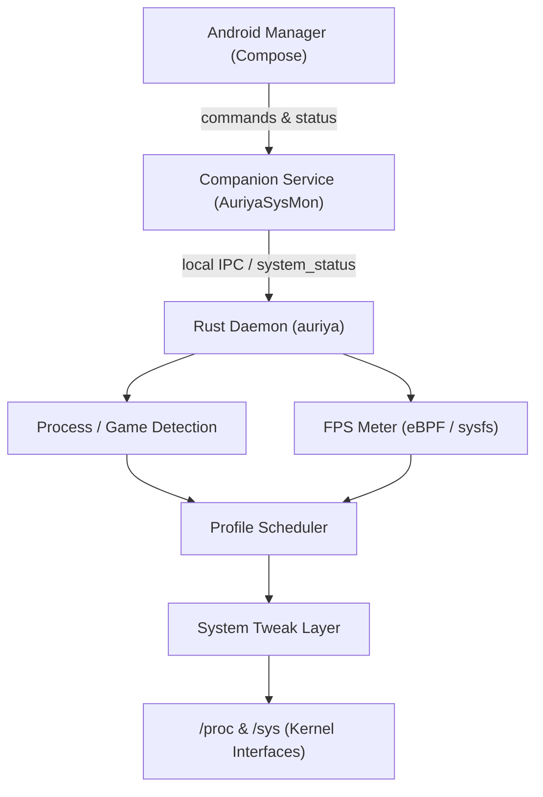
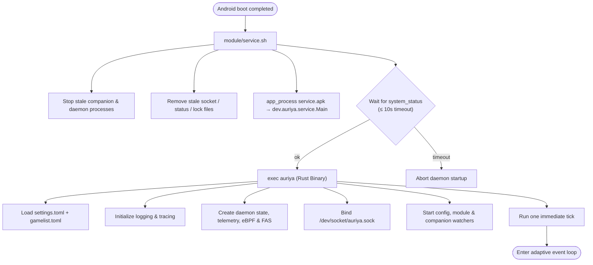
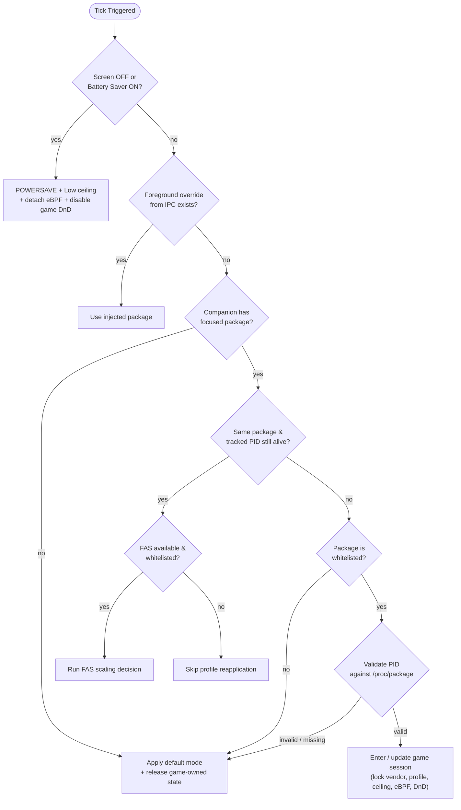

# Ringkasan Arsitektur

Auriya adalah modul performa root Android yang terdiri dari tiga lapisan runtime: aplikasi manajer berbasis Jetpack Compose, Android companion service, dan daemon Rust (aarch64). Daemon bertindak sebagai pemilik pemantauan sistem, transisi profil, telemetri, dan penulisan ke `/proc`/`sys`; komponen Android menangani integrasi siklus hidup sistem dan antarmuka kontrol pengguna.

Aplikasi Android manajer mengelola interaksi pengguna dan UI. Companion service menjembatani batasan siklus hidup Android. Daemon Rust mengelola pemantauan jangka panjang, penjadwalan, telemetri, dan modifikasi kernel.

CLI kontrol di `src/ctl.rs` (`auriyactl`) menyediakan titik masuk kedua untuk memeriksa atau mengendalikan daemon tanpa melalui UI Compose.

## Alur Eksekusi Binary {#binary-execution-workflow}

Modul yang terinstal tidak menjalankan daemon melalui aplikasi Android. Saat boot, `module/service.sh` menunggu sinyal `sys.boot_completed` Android, menjalankan APK companion via `app_process`, menunggu hingga 10 detik file `/data/adb/.config/auriya/system_status`, lalu mengeksekusi binary `/data/adb/modules/auriya/system/bin/auriya`. Log standar dialirkan ke logcat dan `/data/adb/auriya/daemon.log`.

Titik masuk Rust memuat kedua file konfigurasi sebelum menginisialisasi tracing; kesalahan parsing akan membatalkan start daemon demi keamanan.

## Event Loop dan Irama Eksekusi {#event-loop-and-execution-cadence}

Daemon menggunakan runtime Tokio single-thread untuk orkestrasi, ditambah thread/task latar belakang untuk watcher, eBPF, dan operasi I/O perangkat. Setelah satu tick awal, `tokio::select!` menunggu event pertama yang tersedia:

| Event | Aksi yang Dilakukan |
| --- | --- |
| Timer | Menjalankan tick setiap 500 ms saat sesi game aktif, 5 detik di kondisi normal, atau 10 detik saat layar mati / hemat daya aktif |
| Update Status Companion | Menjalankan tick langsung tanpa menunggu timer |
| Update Konfigurasi settings | Memuat ulang governor default / mode default; menerapkan governor baru seketika jika profil aktif adalah Balance |
| Update gamelist | Membangun ulang whitelist, membersihkan PID/package yang dipantau, lalu menjalankan tick langsung |
| PID Game yang Dipantau Keluar | Menjalankan tick langsung untuk mereset profil |
| Kunci Companion Terlepas | Menandai companion mati dan mencoba restart berjangka |
| Update Modul / Sinyal Ctrl-C | Melepas vendor lock, mereset batas frekuensi/core, lalu keluar secara bersih |

## Alur Pengambilan Keputusan Profil {#profile-decision-workflow}

Penjadwal profil mengevaluasi kondisi sistem dalam urutan prioritas yang ketat.

### Masuk ke Game dalam Whitelist {#entering-a-whitelisted-game}

Saat sesi game baru terdeteksi:
1. Mengunci kontrol vendor (vendor lock) agar layanan eksternal tidak menimpa nilai Auriya.
2. Mengirimkan siaran toast `dev.auriya.app.ACTION_SHOW_TOAST` dengan mode yang dipilih.
3. Menerapkan profil target hanya jika berbeda dari mode saat ini.
4. Menerapkan batas frekuensi (ceiling) dan refresh rate layar.
5. Memasang probe frame eBPF Kala pada PID game yang tervalidasi.
6. Mengatur mode Jangan Ganggu (DnD) jika `enable_dnd = true`.

### Apa yang Diubah oleh Profil Statis {#what-each-static-profile-changes}

| Profil | Aksi yang Dilakukan |
| --- | --- |
| Performance | Mengatur governor CPU performa, mengaktifkan CPU boost, menyalakan seluruh core CPU, menerapkan hook performa Snapdragon/MediaTek, mengatur mode GPU performa, mengaktifkan touch game mode, mengatur tweak scheduler/storage/memory, dan mengatur afinitas CPU game |
| Balance | Mengatur governor default yang dikonfigurasi, mematikan CPU boost, mengembalikan mode normal vendor, mengatur mode GPU seimbang, mematikan touch game mode, dan mengembalikan default scheduler |
| Powersave | Mengatur governor CPU ke `powersave` dan meminta swappiness `60` |

### Perubahan Dinamis FAS di Dalam Game {#fas-dynamic-changes-inside-the-same-game}

Saat package dan PID tidak berubah, FAS membaca aliran data frame Kala dan memilih aksi penskalaan:

| Aksi FAS | Efek yang Diterapkan |
| --- | --- |
| `BoostGpu` | Mendorong performa GPU saja; setelan CPU tidak diubah |
| `BoostCpu` | Governor game, CPU boost, core online, scheduler performa, afinitas CPU; GPU disetel seimbang |
| `BoostBalanced` | Profil Performance penuh |
| `Maintain` | Tidak ada penulisan ke sistem (stabil) |
| `Reduce` | Mengurangi beban kembali ke `daemon.default_mode` |

### Keluar dari Game {#leaving-a-game-or-losing-foreground-state}

Saat game ditutup atau kehilangan fokus, daemon otomatis kembali ke `daemon.default_mode`, mereset batas frekuensi, mencabut probe eBPF, mematikan DnD, melepas vendor lock, dan mengembalikan refresh rate ke normal (0 Hz).

## Jalur Kontrol dan Status {#control-and-status-paths}

`auriyactl` dan klien Android terhubung ke `/dev/socket/auriya.sock`; mereka tidak memanggil fungsi profil secara langsung. Status companion mengalir melalui `/data/adb/.config/auriya/system_status`.

## Batasan Runtime {#runtime-boundaries}

- **Aplikasi Manajer (`android/app`)**: UI Compose, pengeditan pengaturan/gamelist, widget, tile, overlay, dan monitoring.
- **Shared Kotlin (`android/shared`)**: Model data TOML, parser, dan protokol serialisasi IPC.
- **Companion Service (`android/service`)**: Sensor status foreground, daya baterai, dan Zen/DnD via `app_process`.
- **Daemon Rust (`src/main.rs`, `src/daemon`)**: Event loop, socket `/dev/socket/auriya.sock`, telemetri FPS, penjadwalan profil, dan tweak kernel.
- **CLI Rust (`src/ctl.rs`)**: Klien baris perintah untuk mengontrol daemon tanpa UI.
