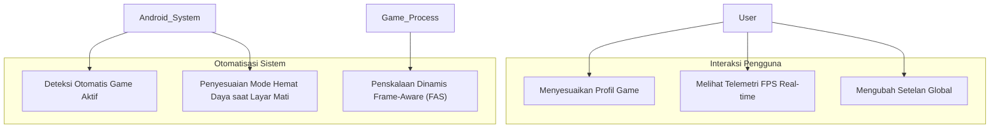

# Skenario Penggunaan (Use Cases)

Halaman ini memetakan berbagai skenario interaksi pengguna dan sistem dengan modul Auriya.

## Aktor dalam Sistem {#actors}

- **Pengguna Biasa (User)**: Berinteraksi melalui aplikasi manajer berbasis Compose untuk memilih profil, memantau telemetri, atau mengonfigurasi game.
- **Pengguna Mahir / Developer**: Berinteraksi melalui baris perintah (`auriyactl`) atau mengedit file TOML secara langsung.
- **Sistem Android**: Memberikan sinyal status (aplikasi foreground, layar menyala/mati, mode hemat baterai).
- **Proses Game**: Berjalan di ruang pengguna dan dipantau oleh probe frame eBPF.

## Peta Skenario Utama {#use-case-map}

### Skenario 1: Menjalankan Game Berat

1. Pengguna membuka game (misalnya game 120 FPS).
2. Companion service mendeteksi package game di latar depan.
3. Daemon memeriksa whitelist di `gamelist.toml` dan memvalidasi PID.
4. Daemon beralih ke profil `Performance`, mengaktifkan vendor lock, mengatur refresh rate layar, memasang probe eBPF Kala, dan menyalakan mode Jangan Ganggu (DnD).
5. FAS memantau waktu per frame dan secara dinamis menyesuaikan clock CPU/GPU untuk mempertahankan 120 FPS stabil.

### Skenario 2: Menutup Game / Kembali ke Beranda

1. Pengguna keluar dari game ke launcher Android.
2. Companion service mendeteksi bahwa game tidak lagi di foreground.
3. Daemon mereset profil ke mode `Balance` default, melepas vendor lock, mencabut probe eBPF, mengembalikan refresh rate normal, dan mematikan DnD.

### Skenario 3: Layar Mati / Mode Hemat Baterai

1. Pengguna mengunci layar atau Android mengaktifkan Battery Saver.
2. Companion service mengirimkan sinyal status.
3. Daemon seketika beralih ke mode `Powersave`, membatasi frekuensi CPU/GPU ke level terendah, dan memperlambat interval tick menjadi 10 detik demi efisiensi energi maksimal.