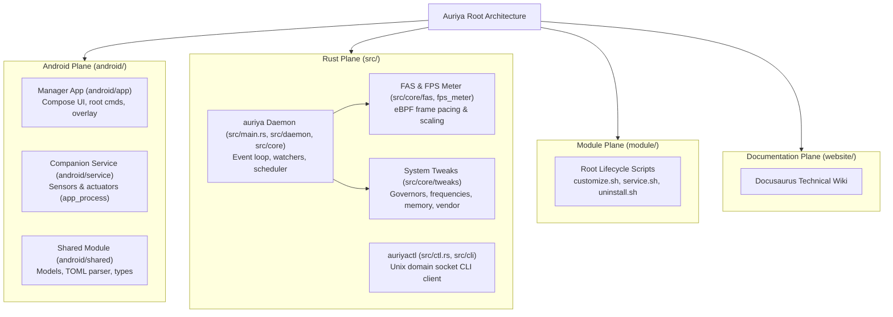

Auriya is three runtime planes plus shared code. This page names each component,
where it lives, and what it owns. For how they interact at runtime see
[Data flow](/architecture/data-flow/); for the whole-system flow see
[Architecture overview](/architecture/overview/).

## Android manager — `android/app/`

The user-facing app (package `dev.auriya.app`). Renders the Compose UI, persists
appearance/onboarding preferences, requests root, edits `settings.toml` /
`gamelist.toml`, and displays live daemon status. It is a **client** of the
daemon over the Unix socket — it does not itself apply tweaks. Installed by
`customize.sh` via `pm install` ([Installation](/getting-started/installation/)).

## Companion service — `android/service/`

A headless service (process `AuriyaSysMon`, launched via `app_process`, package
identity `dev.auriya.service`). It bridges Android-only capabilities the root
daemon cannot reach:

- **Sensors** → writes the foreground app/PID, screen state, battery-saver, and
  Zen/DnD state to `/data/adb/.config/auriya/system_status`.
- **Actuators** → replays daemon-requested DnD and refresh-rate changes through
  Android framework APIs, driven by the `auriya_cmd` file
  ([System tweaks → CmdWriter](/internals/system-tweaks/#actions-routed-through-android--cmdwriter)).

Its liveness is tracked via `companion.lock` (see
[Architecture overview](/architecture/overview/#control-and-status-paths)). Full internals —
sensors, actuators, atomic file IO — are documented in
[Companion service](/internals/companion/).

## Shared Kotlin — `android/shared/`

Models and codecs used by both the app and the companion: the `Settings` /
`GameProfile` / `SystemStatus` data classes, the TOML parser/serializer
(`TomlParser.kt`), and the command/status wire formats. This is where the app's
view of `settings.toml` is defined — and why config keys must stay in sync
between here and the Rust `Settings` struct
([settings reference](/reference/settings/#schema-sync-rust--app)).

:::note `android/shared/bin/` is generated
`android/shared/bin/` mirrors the shared Kotlin for tooling and is **not** the
source of truth; edit `android/shared/src/`.
:::

## Rust daemon — `src/main.rs` + `src/daemon/` + `src/core/`

The long-running root process (binary `auriya`). Loads config, runs the event/tick
loop, serves the IPC socket, observes foreground/FPS/telemetry, selects a profile,
and applies tweaks. Two binary targets are declared in `Cargo.toml`:

| Binary | Entry | Role |
| --- | --- | --- |
| `auriya` | `src/main.rs` | The daemon. |
| `auriyactl` | `src/ctl.rs` | The control CLI. |

Core subsystems (`src/core/`): `config/` (settings + game profiles),
`system_status/` (companion snapshot cache), `pid_tracker.rs` (foreground
liveness), `fps_meter/` (FPS telemetry), `fas/` + `daemon/fas.rs` (frame-aware
scheduling), `telemetry/` (CPU/GPU/thermal), `tweaks/` (kernel writes),
`cmd_writer/` (companion command file), `display.rs` (supported modes).

## Control CLI — `src/ctl.rs` + `src/cli/`

`auriyactl` — a line-oriented client for the same Unix socket
([Command reference](/reference/commands/)). As of this revision it is a
secondary control surface; the app is primary.

## Kernel/device boundary — `src/core/tweaks/`, telemetry, eBPF

Best-effort reads and guarded writes to vendor-dependent `/proc` and `/sys`
nodes, plus the eBPF frame probe. Missing nodes are skipped
([System tweaks](/internals/system-tweaks/)).

## Architecture tree

For the exact source-tree layout of files on disk, see
[Project structure](/development/project-structure/).
