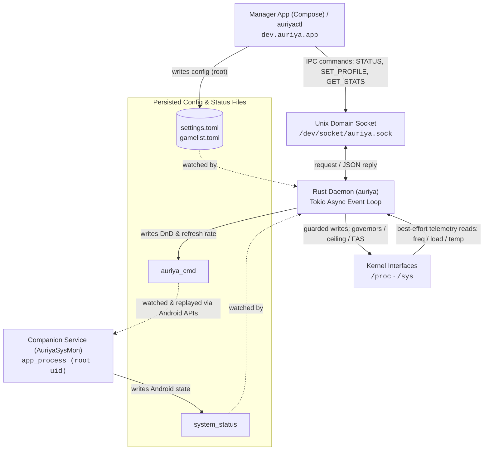
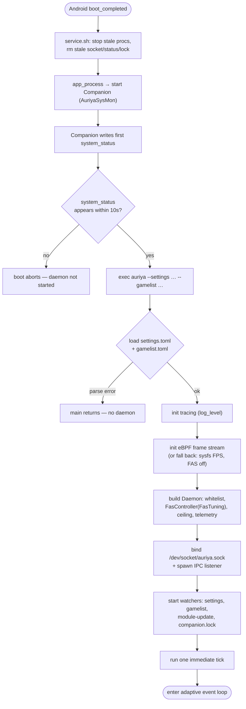
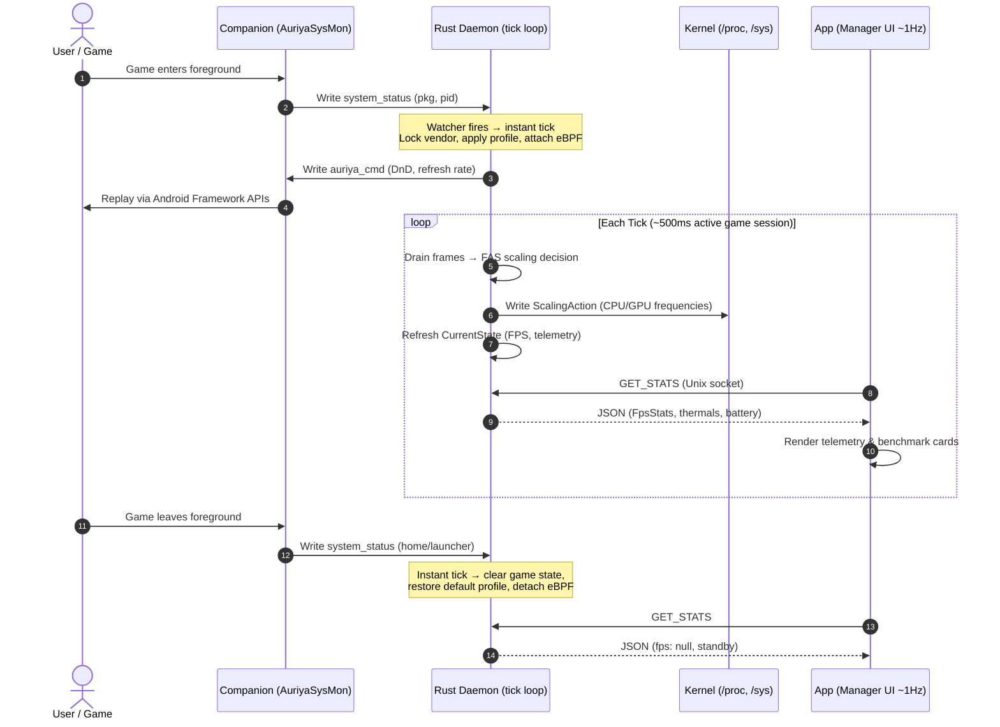

Two independent flows cross the same three planes: **commands** (a client asks for
a state change) and **telemetry/state** (observed state flows back). They must be
read separately — a command is a request, telemetry is a report — and a failure at
either boundary must stay visible to the caller.

## End-to-end: everything running

The full picture once the module is installed and a game is in the foreground —
who talks to whom, over which channel, with the real path/command. Every arrow is
one of the four channels in the [table below](#the-four-channels-concretely).



The app and `auriyactl` talk to the daemon **directly** over the socket for
commands and status. The companion is a *separate* participant: it feeds the
daemon observed Android state (`system_status`) and executes the Android-framework
actions the root daemon cannot (`auriya_cmd`) — see
[System tweaks → CmdWriter](../internals/system-tweaks#actions-routed-through-android--cmdwriter).

## Boot sequence (cold start → first tick)

What happens from power-on until the daemon is serving requests, per
`module/service.sh` and `src/daemon/run.rs` (full detail:
[overview → binary execution](overview#binary-execution-workflow)):



## Steady-state: one game session, tick by tick

The command/telemetry round trip while a whitelisted game runs and the app polls:



The eBPF worker only drains frames while a PID is attached, so it costs nothing
outside a game session. `GET_STATS` computes on request — see
[Stats API](../reference/stats-api).

## The four channels concretely

| Direction | Mechanism | Payload | Reference |
| --- | --- | --- | --- |
| Client → daemon | Unix socket, newline text | commands: `STATUS`, `SET_PROFILE`, `ADD_GAME`, `GET_STATS`, … | [IPC protocol](../internals/ipc-protocol) |
| Companion → daemon | `system_status` file (watched) | foreground app/PID/UID, screen, battery-saver, Zen | below |
| Daemon → companion | `auriya_cmd` file (watched) | DnD filter, refresh rate | [System tweaks → CmdWriter](../internals/system-tweaks#actions-routed-through-android--cmdwriter) |
| Daemon → kernel | `/proc`, `/sys` writes | governors, ceilings, tweaks | [System tweaks](../internals/system-tweaks) |

The exact struct/field shapes of these payloads are in the
[data model](data-model).

## `system_status` — companion → daemon

The companion writes `/data/adb/.config/auriya/system_status` whenever the
foreground app, screen, battery-saver, or Zen state changes. The wire format is
line-oriented (`src/core/system_status/mod.rs:8-11`):

```text
focused_app <package> <pid> <uid>
screen_awake <0|1>
battery_saver <0|1>
zen_mode <0|1|2|3>
```

The daemon's watcher reloads this file and merges it into a `CurrentState`
snapshot that IPC clients read. Fields are optional — a partial write updates only
the lines present (`SystemStatus`, `mod.rs:27-56`). The daemon uses `focused_app`
+ `focused_pid` for [game detection](../internals/game-detection), and
`screen_awake` + `battery_saver` to force the power-save branch of the
[scheduler](../internals/profile-scheduler#decision-order).

## Tick flow

The daemon runs a variable-cadence tick (see
[Architecture overview → Event loop](../architecture/overview#event-loop-and-execution-cadence)
for the exact event table):

- **≈ 500 ms** while a validated game session is active,
- **`daemon.check_interval_ms`** (default 2 s) in normal foreground operation,
- **10 s** when screen-off / battery-saver suspends normal work.

Each tick reads the cached companion snapshot, handles power-saving overrides
first, resolves the package/PID (or an `INJECT` override), then either runs FAS
for a known game or applies the appropriate profile
([Profile scheduler](../internals/profile-scheduler)). A copy-on-write game-list
snapshot avoids holding a lock across async work. A tick can also be triggered
early — outside the timer — by a companion update, a config change, or a tracked
PID exiting ([game detection](../internals/game-detection#liveness-tracking-and-instant-exit)).

## Failure visibility

- IPC errors are returned to the client as `ERR …` lines
  ([IPC protocol → response conventions](../internals/ipc-protocol#response-conventions)).
- Kernel-write failures are best-effort and logged, not fatal
  ([System tweaks](../internals/system-tweaks#guarded-best-effort-writes)).
- A dead companion is detected via `companion.lock`; display/DnD then fall back to
  Android `settings put`
  ([overview](../architecture/overview#control-and-status-paths)).

