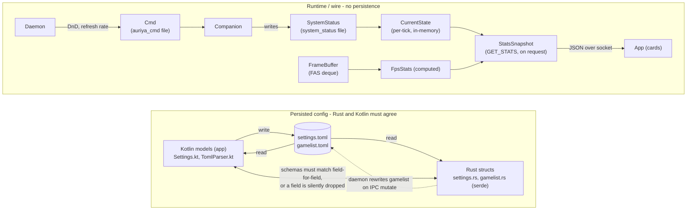

Auriya has no database — its "entities" are configuration files, in-memory
snapshots, and wire payloads that cross the Rust ↔ Android boundary. This page maps
them: what each entity is, **where it lives**, and **which direction it syncs**.
The single most important property here is **Rust ↔ Kotlin schema parity** for the
config entities — the two sides must agree or a field is silently dropped (there is
no `deny_unknown_fields`).

:::info Verified against source
Rust: `src/core/config/`, `src/core/system_status/`, `src/core/cmd_writer/`,
`src/daemon/state.rs`, `src/core/stats/`, `src/core/telemetry/`. Kotlin:
`android/shared/src/main/kotlin/dev/auriya/shared/model/` + `.../config/TomlParser.kt`.
:::

## Entity map (who owns what, sync direction)

## Config entities (Rust ↔ Kotlin — must stay in sync)

These have **two authoritative definitions** — a Rust struct (what the daemon
consumes) and a Kotlin data class (what the app reads/writes). They are joined by
the TOML file. Keeping them equal is a hard requirement.

### `Settings` ↔ `settings.toml` ↔ `Settings.kt`

| Group | Rust (`settings.rs`) | Kotlin (`Settings.kt`) | Notes |
| --- | --- | --- | --- |
| `[daemon]` | `DaemonConfig { log_level, check_interval_ms, default_mode }` | `DaemonConfig(logLevel, checkIntervalMs, defaultMode)` | Parity |
| `[cpu]` | `CpuConfig { default_governor }` | `CpuConfig(defaultGovernor)` | Parity |
| `[dnd]` | `DndConfig { default_enable }` | `DndConfig(defaultEnable)` | Parity |
| `[fas]` | `FasConfig { enabled, default_mode, thermal_threshold, poll_interval_ms, target_fps }` | `FasConfig(enabled, defaultMode, thermalThreshold, pollIntervalMs, targetFps)` | Parity (all 5) |
| `[dynamic_governor]` | `DynamicGovernorConfig { enabled, cv_threshold, debounce_frames }` | `DynamicGovernorConfig(enabled, cvThreshold, debounceFrames)` | Parity |
| `[modes.*]` | `HashMap<String, FasMode { margin, thermal_threshold }>` | `Map<String, FasMode(margin, thermalThreshold)>` | Parity |

Full per-key meaning + which the daemon consumes: [settings reference](../reference/settings).

### `GameProfile` ↔ `[[game]]` ↔ Kotlin

| Field | Type | Required | Notes |
| --- | --- | --- | --- |
| `package` | string | Yes | whitelist key |
| `cpu_governor` | string | Yes | |
| `enable_dnd` | bool | Yes | |
| `target_fps` | int **or** int[] | — | custom deserializer (`TargetFpsConfig`) |
| `refresh_rate` | int | — | |
| `mode` | string | — | `powersave`/`balance`/`performance`/`fast` |
| `ceiling` | string | — | |

Full detail: [gamelist reference](../reference/gamelist).

:::warning The schema-sync rule
There is no `#[serde(deny_unknown_fields)]`. If you add a key to one side only:
- key in TOML but not the Rust struct → **silently dropped** on load;
- key the app writes but the daemon doesn't read → **dead config** (parsed, no effect).

So a new setting is a **three-place change**: Rust struct (+ consume it),
`settings.toml`/`gamelist.toml` default, and the Kotlin model + `TomlParser`.
Do **not** add a field only one side uses. This is why per-game *UI-only* flags
(e.g. auto-record enable) live in app SharedPreferences, **not** in `gamelist.toml`.
:::

## Runtime / wire entities (no persistence)

These are transient — computed per tick or per request, never stored.

### `SystemStatus` (companion → daemon)

`src/core/system_status/mod.rs`. Parsed from the `system_status` file; all fields
`Option` (partial writes allowed).

| Field | Type |
| --- | --- |
| `focused_app` | `Option<String>` |
| `focused_pid` | `Option<i32>` |
| `focused_uid` | `Option<i32>` |
| `screen_awake` | `Option<bool>` |
| `battery_saver` | `Option<bool>` |
| `zen_mode` | `Option<u8>` |

### `Cmd` (daemon → companion, `auriya_cmd`)

`src/core/cmd_writer/mod.rs`. Stateful writer re-emits full state each write.

| Field | Type |
| --- | --- |
| `dnd` | `Option<DndFilter>` (All / Priority) |
| `refresh_rate` | `Option<u32>` (0 = restore) |

### `CurrentState` (in-memory, per-tick)

`src/daemon/state.rs`. Refreshed every tick; read by IPC `STATUS` / `GET_STATS`.
Holds `pkg`, `pid`, `screen_awake`, `battery_saver`, `profile`, `companion_alive`,
`cpu_telemetry`, `gpu_telemetry`, `thermal_telemetry`, `fps`, `fps_source`, and
`game_session` (true only for a whitelisted game — the record trigger).

### `StatsSnapshot` (`GET_STATS`, computed on request)

`src/core/stats/mod.rs`. Assembled per request from `CurrentState` + a fresh
`BatterySnapshot` + FPS stats from the FAS `FrameBuffer`. Serialized to JSON,
grouped one-per-UI-card. This is the **stable contract for the app** — schema and
null rules in [Stats API](../reference/stats-api).

### Telemetry snapshots (point reads, per tick or per request)

`CpuSnapshot`, `GpuSnapshot`, `ThermalSnapshot` (`src/core/telemetry/`) — sampled
each tick into `CurrentState`. `BatterySnapshot` (`telemetry/battery.rs`) — read
fresh on each `GET_STATS`. All fields best-effort `Option`.

## Lifecycle at a glance

| Entity | Created by | Lives in | Read by | Persisted? |
| --- | --- | --- | --- | --- |
| `Settings` / `GameProfile` | app (or install defaults) | TOML on disk | daemon (startup/watch) | Yes (file) |
| `SystemStatus` | companion | `system_status` file | daemon (watch) | Yes (file, transient) |
| `Cmd` | daemon | `auriya_cmd` file | companion (watch) | Yes (file, transient) |
| `CurrentState` | daemon tick | RAM | IPC handlers | No (RAM only) |
| `StatsSnapshot` | IPC handler | RAM → JSON | app | No (per-request) |
| `current_profile` | daemon | file (`1`/`2`/`3`) | legacy readers | Yes (file) |

## See also

- [Data flow](data-flow) — how these entities move at runtime.
- [Components](components) — the processes that own them.
- [settings](../reference/settings) · [gamelist](../reference/gamelist) ·
  [Stats API](../reference/stats-api) — the field-level specs.