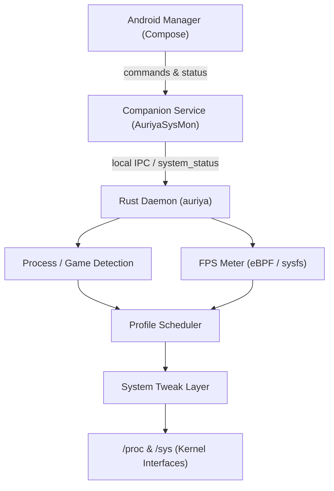
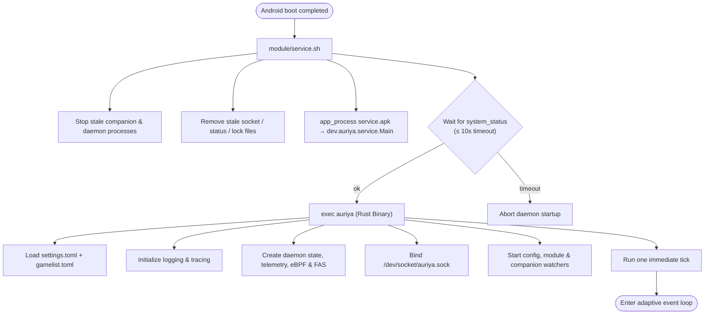
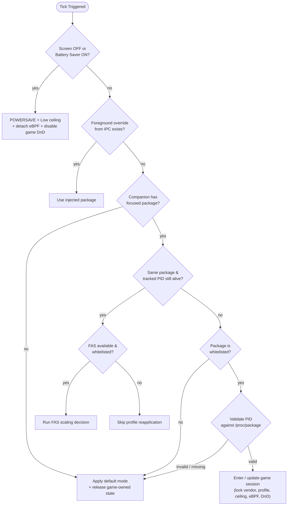

Auriya is a rooted Android performance module composed of three runtime planes: a Compose manager app, a companion Android service, and an aarch64 Rust daemon. The daemon is the owner of observation, profile transitions, telemetry, and writes to `/proc`/`sys`; Android components provide lifecycle integration and user-facing control.

The Android manager owns user interaction and presentation. The companion service bridges Android lifecycle constraints. The Rust daemon owns long-running observation, scheduling, telemetry, and system writes.

The control CLI in `src/ctl.rs` provides a second entry point for querying or controlling the daemon without the Compose UI.

## Binary execution workflow

The installed module does not launch the daemon through the Android app. At boot, `module/service.sh` waits for Android's `sys.boot_completed`, starts the bundled companion APK with `app_process`, waits up to 10 seconds for `/data/adb/.config/auriya/system_status`, then executes `/data/adb/modules/auriya/system/bin/auriya` with the installed settings and gamelist paths. Standard output/error are piped into logcat and `/data/adb/auriya/daemon.log`. See [module lifecycle](module-lifecycle) for the installation paths.

The Rust entry point loads both configuration files before initializing tracing; a load/parse error returns from `main` and prevents daemon startup ([`main`](https://github.com/pavelc4/auriya/blob/10fe7c6b56474a00513fec34ebac1376b30e95e6/src/main.rs#L8-L49)). `run_with_config` refuses to continue when the companion status file is not populated within 10 seconds. Failure to enumerate display modes is non-fatal and produces an empty supported-mode list ([`run_with_config`](https://github.com/pavelc4/auriya/blob/10fe7c6b56474a00513fec34ebac1376b30e95e6/src/daemon/run.rs#L574-L607)).

## Event loop and execution cadence

The daemon is a single-thread Tokio runtime for orchestration, with background threads/tasks for watchers, eBPF, and blocking device work. After one immediate tick, `tokio::select!` waits for the first available event ([event loop](https://github.com/pavelc4/auriya/blob/10fe7c6b56474a00513fec34ebac1376b30e95e6/src/daemon/run.rs#L624-L681)):

| Event | Result |
| --- | --- |
| timer | run a tick after 500 ms in a validated game session, 5 seconds normally, or 10 seconds when screen-off/battery-saver state suspends normal work |
| companion status update | run an immediate tick; no timer wait |
| settings update | reload default governor/default mode; reapply the governor immediately only when the current profile is Balance |
| gamelist update | rebuild the whitelist, clear tracked package/PID, then run an immediate tick |
| tracked PID exit | run an immediate tick |
| companion lock release | mark the companion dead and attempt a rate-limited restart |
| staged module update or Ctrl-C | release vendor locks and ceiling/core overrides, then exit cleanly |

Tick errors do not terminate the loop. Identical errors are log-debounced for 30 seconds; successful ticks refresh the shared IPC status with package, PID, profile, power state, FPS source/value, and CPU/GPU/thermal telemetry ([`Daemon::tick`](https://github.com/pavelc4/auriya/blob/10fe7c6b56474a00513fec34ebac1376b30e95e6/src/daemon/tick.rs#L24-L88)).

## Profile decision workflow

The profile scheduler evaluates conditions in strict priority order. A lower branch is not evaluated after a higher branch returns.

This order is implemented by `Daemon::process_tick_logic` ([source](https://github.com/pavelc4/auriya/blob/10fe7c6b56474a00513fec34ebac1376b30e95e6/src/daemon/tick.rs#L91-L192)). Screen-off or battery saver always wins, even if a game remains foregrounded. The daemon only calls a full profile application when `last.profile_mode` differs from the target mode; repeated ticks do not rewrite every kernel node.

### Entering a whitelisted game

`handle_whitelisted_app` validates the focused PID before applying game state ([source](https://github.com/pavelc4/auriya/blob/10fe7c6b56474a00513fec34ebac1376b30e95e6/src/daemon/tick.rs#L194-L307)). On a new game session it:

1. Locks vendor-owned controls so external vendor services cannot immediately overwrite Auriya's values.
2. Broadcasts `dev.auriya.app.ACTION_SHOW_TOAST` with the chosen mode.
3. Reads the game profile. Missing/unknown `mode` defaults to Performance; recognized values are `performance`, `balance`, and `powersave`.
4. Applies the target profile only when it differs from the current mode.
5. Applies the game ceiling override, or the configured default ceiling when none exists.
6. Requests the configured refresh rate when it differs from the active override.
7. Attaches the Kala eBPF frame probe to the validated game PID.
8. Requests Priority DnD when `enable_dnd=true`, otherwise All/normal notifications.
9. Stores the package and creates a PID tracker.

If PID validation fails, the daemon does not apply the game profile; it falls back to the configured default mode and clears game-specific state.

### What each static profile changes

These are the direct actions in `src/core/profile.rs`; individual tweak modules decide which device paths exist.

| Profile | Actions |
| --- | --- |
| Performance | set requested CPU governor, enable CPU boost, online cores, apply MediaTek/Snapdragon performance hooks, set GPU performance mode, enable touch game mode, apply general/scheduler/storage/memory tweaks, drop caches, and optionally set game CPU affinity/priority |
| Balance | set the configured governor, disable CPU boost, restore vendor normal mode, set balanced GPU mode, disable touch game mode, restore scheduler/storage/memory defaults |
| Powersave | set CPU governor to `powersave` and request swappiness `60`; it does not run the Balance restoration sequence first |

Fatal `?` operations return an error and the daemon leaves `last.profile_mode` unchanged. Operations wrapped by `warn_on_err` log a warning but allow the profile call to succeed. DnD is deliberately not owned by these functions; the daemon synchronizes it from game-session state so an FAS mode reduction does not incorrectly re-enable notifications ([profile functions](https://github.com/pavelc4/auriya/blob/10fe7c6b56474a00513fec34ebac1376b30e95e6/src/core/profile.rs#L96-L251)).

### FAS dynamic changes inside the same game

When the package and PID are unchanged, the daemon avoids full re-entry logic. If Frame-Aware Scheduling (FAS) exists, it consumes the shared Kala frame stream and chooses one `ScalingAction` ([`run_fas_tick`](https://github.com/pavelc4/auriya/blob/10fe7c6b56474a00513fec34ebac1376b30e95e6/src/daemon/tick.rs#L442-L515)):

| FAS action | Applied change |
| --- | --- |
| `BoostGpu` | GPU performance mode only; CPU settings remain untouched |
| `BoostCpu` | game governor, CPU boost, online cores, performance scheduler, process affinity/priority; GPU is set balanced |
| `BoostBalanced` | full Performance profile unless already marked Performance |
| `Maintain` | no system write |
| `Reduce` | return to `daemon.default_mode` unless already there |

FAS errors are warnings in the caller and do not stop the tick loop. The eBPF measurement method and its limitations are documented once in [Kala eBPF frame probe](../internals/kala-research).

### Leaving a game or losing foreground state

For a non-whitelisted package, invalid/missing PID, or no foreground package, the daemon applies `daemon.default_mode` only when required, restores the default ceiling, detaches eBPF, requests normal notifications, clears the PID tracker, unlocks vendor controls, and releases any refresh-rate override by requesting `0` Hz ([clear path](https://github.com/pavelc4/auriya/blob/10fe7c6b56474a00513fec34ebac1376b30e95e6/src/daemon/tick.rs#L309-L440)).

## Control and status paths

`auriyactl` and Android clients connect to `/dev/socket/auriya.sock`; they do not invoke profile functions directly. The IPC handler parses a command, then operates on daemon state or calls a serialized profile function. Companion-originated state travels in the opposite direction through `/data/adb/.config/auriya/system_status`. Display and DnD requests normally go through the companion command writer; when the companion is considered dead, refresh rate and Zen mode use Android `settings put` fallbacks. See [IPC protocol](../internals/ipc-protocol) and [filesystem reference](../reference/filesystem).

## Runtime boundaries

- **Manager app (`android/app`)**: Compose UI, settings/game-list editing, root shell access, widget, tile, overlay, and status presentation.
- **Shared Kotlin (`android/shared`)**: TOML paths/parser plus `Settings`, `GameProfile`, `SystemStatus`, and command/status wire models.
- **Companion service (`android/service`)**: foreground/task-stack, power, and Zen/DnD sensors; writes the daemon status snapshot and consumes daemon commands for display/DnD actions.
- **Rust daemon (`src/main.rs`, `src/daemon`)**: loads config, starts the event/tick loop, serves `/dev/socket/auriya.sock`, detects the foreground PID, samples FPS/telemetry, selects a profile, and applies tweaks.
- **Rust CLI (`src/ctl.rs`, `src/cli`)**: line-oriented client for the same Unix socket.
- **Kernel/device boundary (`src/core/tweaks`, telemetry, eBPF)**: best-effort reads and guarded writes to vendor-dependent nodes.
