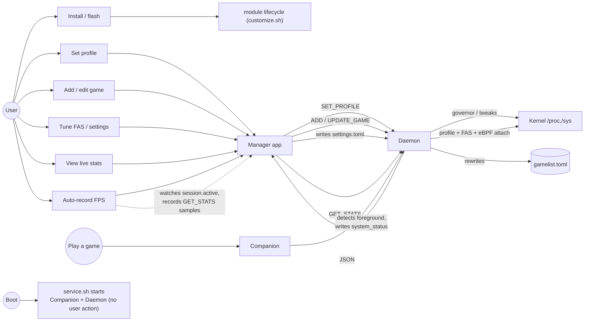

Who does what with Auriya, and the exact path each capability takes through the
system. Actors are the five participants from [Components](/architecture/components/); every flow
below is grounded in the runtime paths described in [Data flow](/architecture/data-flow/).

## Actors

| Actor | Role |
| --- | --- |
| **User** | Person operating the phone — installs, tweaks, plays. |
| **Manager app** | Compose UI (`dev.auriya.app`). Writes config, sends commands, renders telemetry. |
| **Companion** | `AuriyaSysMon`. Observes Android state, executes framework actions. |
| **Daemon** | `auriya` (root). Owns scheduling, tweaks, IPC, telemetry. |
| **Kernel** | `/proc` + `/sys` nodes the daemon reads/writes. |

## Use-case map

## Flows

### UC-1 · Install & first run
**Actor:** User → root manager → `customize.sh` → app.
1. Flash the module ZIP; `customize.sh` verifies arch/checksum, installs daemon +
   companion APK, `pm install`s the app, seeds default TOMLs.
2. Reboot. `service.sh` starts companion + daemon automatically.
3. Open the app, grant root. See [Installation](/getting-started/installation/),
   [First run](/getting-started/first-run/).

### UC-2 · Set a global profile
**Actor:** User → App → Daemon → Kernel.
1. User taps a profile (or tile/widget).
2. App: `echo 'SET_PROFILE PERFORMANCE' | nc -U …sock` (`UiViewModel.kt`).
3. Daemon takes the profile lock, applies governor/GPU/tweaks → `/proc`,`/sys`.
4. Reply `OK SET_PROFILE Performance`. See [IPC](/internals/ipc-protocol/#profile-control).

### UC-3 · Add / edit a game
**Actor:** User → App → Daemon → `gamelist.toml`.
1. User adds a package or edits its overrides on the Games screen.
2. App sends `ADD_GAME <pkg>` / `UPDATE_GAME <pkg> [k=v…]`.
3. Daemon mutates the in-memory list, **atomically rewrites** `gamelist.toml`,
   rebuilds the whitelist. See [gamelist](/reference/gamelist/#how-entries-are-added-and-changed).

### UC-4 · Tune FAS / settings
**Actor:** User → App → `settings.toml` → Daemon.
1. User changes a setting in the app (recommended — no manual file editing;
   see [Configuration](/getting-started/configuration/)).
2. App writes `settings.toml`. Live keys (`cpu.default_governor`,
   `daemon.default_mode`, `check_interval_ms`) apply on reload; FAS keys apply on
   daemon restart. See [Performance tuning](/getting-started/performance-tuning/).

### UC-5 · Play a game (automatic, no user action)
**Actor:** Companion → Daemon → Kernel.
1. Game enters foreground; companion writes `system_status`.
2. Daemon watcher fires an instant tick; if the package is whitelisted with a live
   PID it enters a game session: lock vendor nodes, apply profile, attach the eBPF
   frame probe, request DnD/refresh via `auriya_cmd`.
3. Each tick FAS reads frames and nudges CPU/GPU. On exit, state is cleared and the
   default profile restored. See [Profile scheduler](/internals/profile-scheduler/),
   [Game detection](/internals/game-detection/).

### UC-6 · View live telemetry
**Actor:** User → App → Daemon.
1. App opens the stats screen and polls `GET_STATS` (~1 Hz, root `nc`).
2. Daemon computes FPS stats from the FAS buffer + a battery snapshot, returns
   grouped JSON.
3. App renders one card per group. `fps` is `null` when no game runs. See
   [Stats API](/reference/stats-api/).

### UC-7 · Auto-record FPS per game (app-side)
**Actor:** App (foreground service) driven by daemon signal.
1. User enables auto-record for a whitelisted game (app preference).
2. App watches `session.active` from `GET_STATS`; on `false → true` for that game
   it starts accumulating poll samples, and finalizes a session summary on
   `true → false`.
3. Recording is stored in the app's own sandbox. The daemon provides the *signal*
   (`session.active`) and *data* (`GET_STATS`); the recording logic is app-side —
   see [Stats API → auto-record](/reference/stats-api/#fps-auto-record-app-side).

## See also

- [Data flow](/architecture/data-flow/) — the channels these flows travel on.
- [Data model](/architecture/data-model/) — the entities they move.
- [Components](/architecture/components/) — the actors in detail.