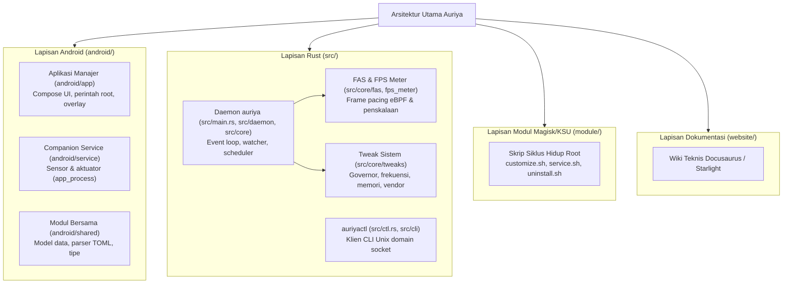

Auriya terdiri dari tiga lapisan runtime ditambah kode bersama (shared code). Halaman ini menjelaskan setiap komponen, lokasinya dalam repositori, serta tanggung jawabnya masing-masing. Untuk memahami cara interaksinya saat runtime, lihat [Aliran data](data-flow); untuk alur sistem secara menyeluruh, lihat [Ringkasan arsitektur](overview).

## Aplikasi Manajer Android — `android/app/`

Aplikasi berbasis UI untuk pengguna (paket `dev.auriya.app`). Merender antarmuka Jetpack Compose, menyimpan preferensi tampilan/onboarding, meminta izin root, mengedit file `settings.toml` / `gamelist.toml`, serta menampilkan status daemon secara real-time. Aplikasi ini bertindak sebagai **klien** dari daemon melalui Unix domain socket — aplikasi itu sendiri tidak menerapkan tweak langsung ke kernel. Diinstal oleh `customize.sh` melalui perintah `pm install` ([Instalasi](../getting-started/installation)).

## Companion Service — `android/service/`

Layanan latar belakang tanpa UI / headless (proses `AuriyaSysMon`, dijalankan via `app_process`, identitas paket `dev.auriya.service`). Layanan ini menjembatani kapabilitas spesifik Android yang tidak dapat diakses langsung oleh daemon root:

- **Sensor** → Menulis aplikasi/PID yang sedang aktif di latar depan (foreground), status layar (on/off), penghemat baterai, dan mode Zen/DnD ke `/data/adb/.config/auriya/system_status`.
- **Aktuator** → Menjalankan perubahan mode DnD dan refresh rate yang diminta daemon melalui framework API Android, dipicu oleh file `auriya_cmd` ([Tweak sistem → CmdWriter](../internals/system-tweaks#actions-routed-through-android--cmdwriter)).

Status keaktifannya dipantau melalui `companion.lock` (lihat [Ringkasan arsitektur](overview#jalur-kontrol-dan-status)). Rincian internal selengkapnya — sensor, aktuator, dan I/O file atomik — didokumentasikan di [Companion service](../internals/companion).

## Kode Bersama Kotlin — `android/shared/`

Model data dan codec yang digunakan bersama oleh aplikasi manajer dan companion: data class `Settings`, `GameProfile`, dan `SystemStatus`, parser/serializer TOML (`TomlParser.kt`), serta format wire perintah dan status. Di sinilah struktur representasi `settings.toml` di sisi aplikasi ditentukan — alasan utama mengapa kunci konfigurasi harus selalu sinkron antara modul ini dan struct `Settings` di Rust ([referensi settings](../reference/settings#sinkronisasi-skema-rust--aplikasi)).

:::note Direktori `android/shared/bin/` dibuat secara otomatis
`android/shared/bin/` merupakan hasil kompilasi/cermin untuk kebutuhan tooling dan **bukan** sumber kode utama; lakukan perubahan pada `android/shared/src/`.
:::

## Daemon Rust — `src/main.rs` + `src/daemon/` + `src/core/`

Proses root utama yang berjalan terus-menerus (binary `auriya`). Bertugas memuat konfigurasi, menjalankan event/tick loop, melayani socket IPC, memantau foreground/FPS/telemetri, memilih profil kerja, dan menerapkan tweak ke kernel. Dua target binary dideklarasikan dalam `Cargo.toml`:

| Binary | Entry Point | Peran |
| --- | --- | --- |
| `auriya` | `src/main.rs` | Daemon utama sistem. |
| `auriyactl` | `src/ctl.rs` | Antarmuka baris perintah (CLI) untuk kontrol. |

Subsistem inti (`src/core/`): `config/` (pengaturan + profil game), `system_status/` (cache snapshot companion), `pid_tracker.rs` (pelacakan keaktifan proses), `fps_meter/` (telemetri FPS), `fas/` + `daemon/fas.rs` (penjadwalan berbasis frame pacing), `telemetry/` (metrik CPU/GPU/termal), `tweaks/` (penulisan ke kernel node), `cmd_writer/` (file perintah companion), dan `display.rs` (mode tampilan yang didukung).

## CLI Kontrol — `src/ctl.rs` + `src/cli/`

`auriyactl` — klien baris perintah berbasis teks untuk Unix socket yang sama ([Referensi perintah](../reference/commands)). Pada rilis ini, CLI berfungsi sebagai antarmuka sekunder; aplikasi manajer adalah kontrol utama.

## Batas Kernel / Perangkat — `src/core/tweaks/`, Telemetri, eBPF

Pembacaan best-effort dan penulisan terproteksi ke node `/proc` dan `/sys` yang bergantung pada vendor SoC, ditambah probe frame eBPF. Node kernel yang tidak ditemukan akan dilewati dengan aman ([Tweak sistem](../internals/system-tweaks)).

## Diagram Arsitektur Komponen

Untuk tata letak struktur file fisik di repositori, lihat [Struktur proyek](../development/project-structure).
