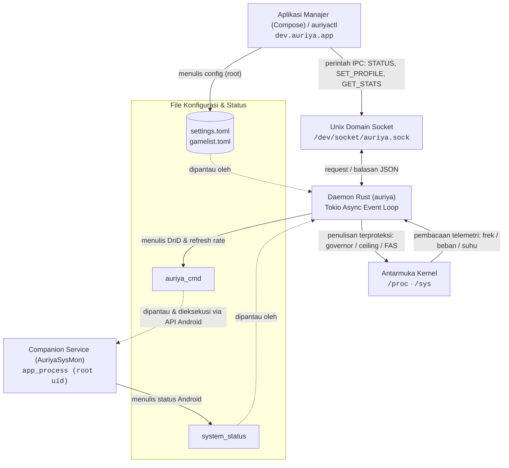
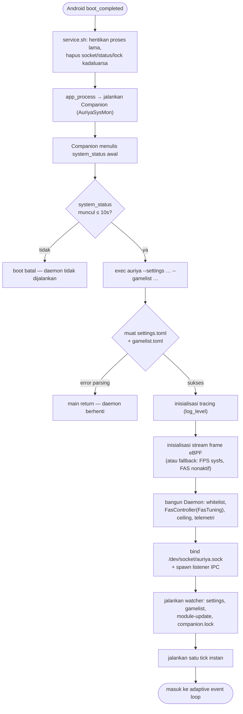
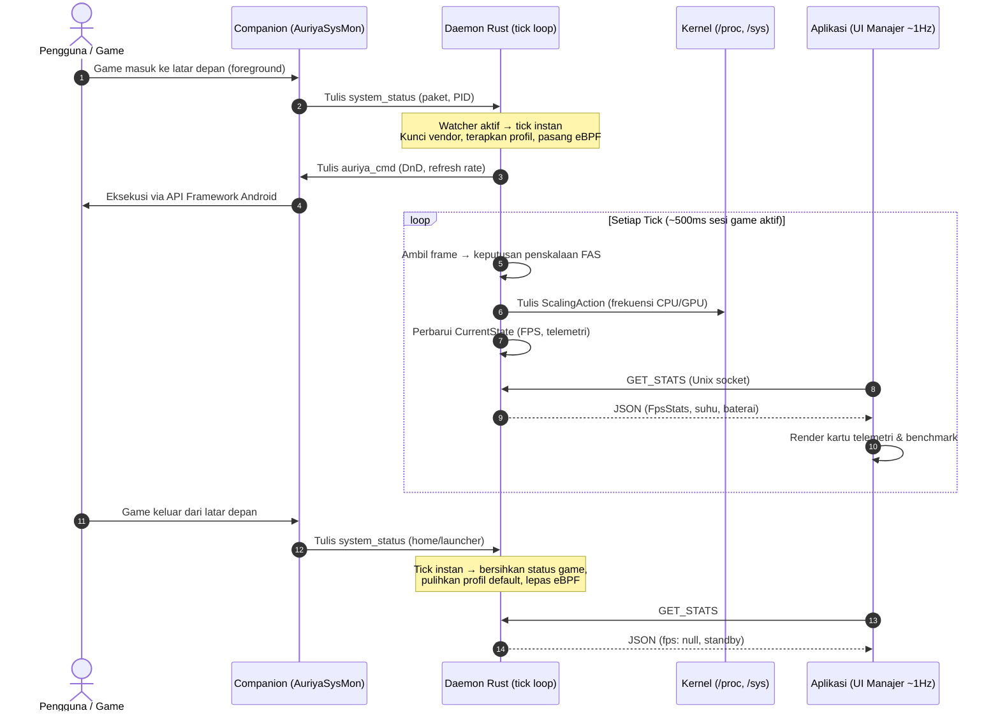

Dua jenis aliran independen melintasi ketiga lapisan runtime yang sama: **perintah** (klien meminta perubahan status) dan **telemetri/status** (data observasi sistem dialirkan kembali). Keduanya harus dipahami secara terpisah — perintah bersifat permintaan (request), sedangkan telemetri adalah laporan (report) — dan kegagalan pada setiap batas antarmuka harus tetap terlihat oleh pemanggil.

## End-to-End: Seluruh Sistem Berjalan

Gambaran lengkap saat modul terpasang dan sesi game berjalan di latar depan — siapa berkomunikasi dengan siapa, melalui saluran apa, dengan jalur file/perintah nyata. Setiap panah mewakili salah satu dari empat saluran pada [tabel di bawah ini](#empat-saluran-komunikasi-secara-konkret).



Aplikasi dan `auriyactl` berkomunikasi dengan daemon **secara langsung** melalui socket Unix untuk perintah dan status. Companion adalah partisipan yang *terpisah*: ia menyuplai status observasi Android ke daemon (`system_status`) dan mengeksekusi tindakan framework Android yang tidak dapat dijangkau langsung oleh daemon root (`auriya_cmd`) — lihat [Tweak sistem → CmdWriter](/id/internals/system-tweaks/#actions-routed-through-android--cmdwriter).

## Urutan Boot (Cold Start → Tick Pertama)

Alur yang terjadi sejak ponsel dinyalakan hingga daemon siap melayani permintaan klien, sesuai `module/service.sh` dan `src/daemon/run.rs` (rincian lengkap: [ringkasan arsitektur → alur eksekusi binary](/id/architecture/overview/#alur-eksekusi-binary)):



## Kondisi Steady-State: Satu Sesi Game Berjalan

Alur bolak-balik perintah dan telemetri selama game yang terdaftar di whitelist berjalan dan aplikasi memantau metrik:



Worker eBPF hanya memproses frame saat ada PID game yang terpasang, sehingga tidak membebani sistem di luar sesi game. `GET_STATS` dihitung berdasarkan permintaan — lihat [API Stats](/id/reference/stats-api/).

## Empat Saluran Komunikasi Secara Konkret

| Arah Aliran | Mekanisme | Payload / Data | Referensi Terkait |
| --- | --- | --- | --- |
| Klien → daemon | Socket Unix, teks berbaris baru | Perintah: `STATUS`, `SET_PROFILE`, `ADD_GAME`, `GET_STATS`, … | [Protokol IPC](/id/internals/ipc-protocol/) |
| Companion → daemon | File `system_status` (dipantau) | Aplikasi foreground/PID/UID, layar, penghemat baterai, Zen | di bawah ini |
| Daemon → companion | File `auriya_cmd` (dipantau) | Filter DnD, refresh rate | [Tweak sistem → CmdWriter](/id/internals/system-tweaks/#actions-routed-through-android--cmdwriter) |
| Daemon → kernel | Penulisan `/proc`, `/sys` | Governor, ceiling frekuensi, tweak sistem | [Tweak sistem](/id/internals/system-tweaks/) |

Struktur struct dan field yang tepat dari payload ini didokumentasikan di [Model data](/id/architecture/data-model/).

## File `system_status` — Companion → Daemon

Companion menulis `/data/adb/.config/auriya/system_status` setiap kali terjadi perubahan aplikasi foreground, status layar, mode penghemat baterai, atau mode Zen. Format datanya berbasis baris teks (`src/core/system_status/mod.rs:8-11`):

```text
focused_app <package> <pid> <uid>
screen_awake <0|1>
battery_saver <0|1>
zen_mode <0|1|2|3>
```

Watcher daemon memuat ulang file ini dan menggabungkannya ke snapshot `CurrentState` yang dibaca oleh klien IPC. Field bersifat opsional — penulisan parsial hanya memperbarui baris yang ada (`SystemStatus`, `mod.rs:27-56`). Daemon menggunakan `focused_app` + `focused_pid` untuk [deteksi game](/id/internals/game-detection/), serta `screen_awake` + `battery_saver` untuk memicu cabang hemat daya pada [penjadwal profil](/id/internals/profile-scheduler/#urutan-pengambilan-keputusan).

## Alur Loop Tick

Daemon menjalankan tick dengan interval yang adaptif (lihat [Ringkasan arsitektur → Event loop](/id/architecture/overview/#event-loop-dan-irama-eksekusi) untuk tabel event):

- **≈ 500 ms** saat sesi game tervalidasi aktif,
- **`daemon.check_interval_ms`** (default 2 detik) pada kondisi normal di latar depan,
- **10 detik** saat layar mati / mode penghemat baterai aktif.

Setiap tick membaca snapshot companion yang dicache, memproses cabang hemat daya terlebih dahulu, membaca paket/PID (atau override `INJECT`), lalu menjalankan FAS untuk game yang terdaftar atau menerapkan profil yang sesuai ([Penjadwal profil](/id/internals/profile-scheduler/)). Snapshot daftar game copy-on-write menghindari penahanan lock saat operasi asynchronous berlangsung. Tick juga dapat dipicu lebih cepat — di luar timer — oleh pembaruan status companion, perubahan konfigurasi, atau saat PID yang dilacak keluar ([deteksi game](/id/internals/game-detection/#pelacakan-keaktifan-dan-keluar-instan)).

## Visibilitas Kesalahan (Failure Visibility)

- Error IPC dikembalikan ke klien dalam format baris `ERR …` ([Protokol IPC → konvensi respons](/id/internals/ipc-protocol/#konvensi-respons)).
- Kegagalan penulisan kernel bersifat best-effort dan dicatat ke log, bukan error fatal ([Tweak sistem](/id/internals/system-tweaks/#penulisan-best-effort-terproteksi)).
- Companion yang mati dideteksi melalui `companion.lock`; pengaturan layar/DnD kemudian beralih ke fallback `settings put` Android ([ringkasan arsitektur](/id/architecture/overview/#jalur-kontrol-dan-status)).
