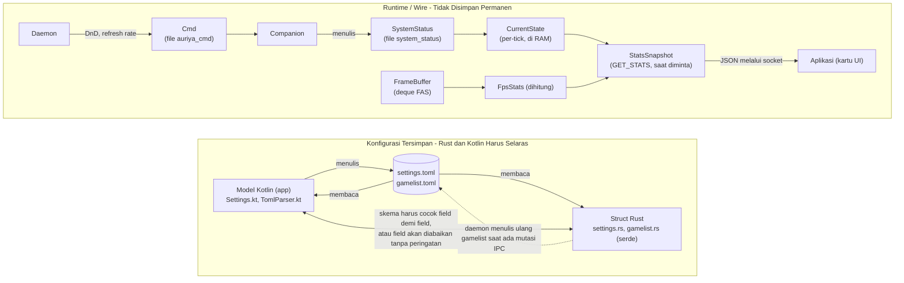

Auriya tidak menggunakan database konvensional — seluruh "entitas" datanya berupa file konfigurasi, snapshot memori (RAM), dan wire payload yang melintasi batas antara Rust ↔ Android. Halaman ini memetakan seluruh entitas: apa fungsinya, **di mana lokasinya**, dan **ke arah mana data disinkronkan**. Prinsip paling krusial di sini adalah **keselarasan skema Rust ↔ Kotlin (schema parity)** untuk entitas konfigurasi — kedua sisi harus memiliki struktur yang identik agar field tidak diabaikan secara diam-diam (karena tidak ada `deny_unknown_fields`).

:::info Diverifikasi langsung terhadap kode sumber
Rust: `src/core/config/`, `src/core/system_status/`, `src/core/cmd_writer/`, `src/daemon/state.rs`, `src/core/stats/`, `src/core/telemetry/`. Kotlin: `android/shared/src/main/kotlin/dev/auriya/shared/model/` + `.../config/TomlParser.kt`.
:::

## Peta Entitas (Kepemilikan & Arah Sinkronisasi)

## Entitas Konfigurasi (Rust ↔ Kotlin — Harus Selalu Sinkron)

Entitas ini memiliki **dua definisi otoritatif** — struct Rust (yang dikonsumsi oleh daemon) dan data class Kotlin (yang dibaca/ditulis oleh aplikasi manajer). Keduanya dihubungkan oleh file TOML. Menjaga kesamaan struktur keduanya adalah keharusan mutlak.

### `Settings` ↔ `settings.toml` ↔ `Settings.kt`

| Grup Konfigurasi | Rust (`settings.rs`) | Kotlin (`Settings.kt`) | Keterangan |
| --- | --- | --- | --- |
| `[daemon]` | `DaemonConfig { log_level, check_interval_ms, default_mode }` | `DaemonConfig(logLevel, checkIntervalMs, defaultMode)` | Selaras (Parity) |
| `[cpu]` | `CpuConfig { default_governor }` | `CpuConfig(defaultGovernor)` | Selaras (Parity) |
| `[dnd]` | `DndConfig { default_enable }` | `DndConfig(defaultEnable)` | Selaras (Parity) |
| `[fas]` | `FasConfig { enabled, default_mode, thermal_threshold, poll_interval_ms, target_fps }` | `FasConfig(enabled, defaultMode, thermalThreshold, pollIntervalMs, targetFps)` | Selaras (semua 5 field) |
| `[dynamic_governor]` | `DynamicGovernorConfig { enabled, cv_threshold, debounce_frames }` | `DynamicGovernorConfig(enabled, cvThreshold, debounceFrames)` | Selaras (Parity) |
| `[modes.*]` | `HashMap<String, FasMode { margin, thermal_threshold }>` | `Map<String, FasMode(margin, thermalThreshold)>` | Selaras (Parity) |

Arti lengkap setiap kunci konfigurasi dan penggunaannya oleh daemon dijelaskan di [referensi settings](/id/reference/settings/).

### `GameProfile` ↔ `[[game]]` ↔ Kotlin

| Field | Tipe Data | Wajib (Required) | Keterangan |
| --- | --- | --- | --- |
| `package` | string | Ya | Kunci identifikasi whitelist |
| `cpu_governor` | string | Ya | Governor yang diterapkan |
| `enable_dnd` | bool | Ya | Status mode Do Not Disturb |
| `target_fps` | int **atau** int[] | — | Deserializer kustom (`TargetFpsConfig`) |
| `refresh_rate` | int | — | Target refresh rate layar (Hz) |
| `mode` | string | — | `powersave`/`balance`/`performance`/`fast` |
| `ceiling` | string | — | Batas atas frekuensi CPU/GPU |

Rincian selengkapnya: [referensi gamelist](/id/reference/gamelist/).

:::warning Aturan Sinkronisasi Skema (Schema-Sync Rule)
Tidak ada atribut `#[serde(deny_unknown_fields)]`. Jika Anda menambahkan kunci hanya di salah satu sisi:
- Kunci ada di file TOML tetapi tidak ada di struct Rust → **diabaikan secara diam-diam** saat dimuat;
- Kunci ditulis oleh aplikasi tetapi tidak dibaca oleh daemon → **konfigurasi mati** (berhasil diparsing tetapi tidak berefek apa-apa).

Oleh karena itu, penambahan setelan baru memerlukan **perubahan di tiga tempat**: struct Rust (+ implementasi penggunaannya), nilai default di `settings.toml`/`gamelist.toml`, dan model Kotlin + `TomlParser`. Jangan menambahkan field yang hanya digunakan oleh satu sisi. Inilah mengapa opsi khusus UI per-game (seperti tombol auto-record) disimpan di SharedPreferences aplikasi, **bukan** di `gamelist.toml`.
:::

## Entitas Runtime / Wire (Tanpa Penyimpanan Permanen)

Entitas ini bersifat transien — dihitung setiap tick atau setiap ada permintaan, dan tidak pernah disimpan ke media penyimpanan secara permanen.

### `SystemStatus` (Companion → Daemon)

`src/core/system_status/mod.rs`. Diparsing dari file `system_status`; seluruh field bertipe `Option` (mendukung pembaruan parsial).

| Field | Tipe Data |
| --- | --- |
| `focused_app` | `Option<String>` |
| `focused_pid` | `Option<i32>` |
| `focused_uid` | `Option<i32>` |
| `screen_awake` | `Option<bool>` |
| `battery_saver` | `Option<bool>` |
| `zen_mode` | `Option<u8>` |

### `Cmd` (Daemon → Companion, `auriya_cmd`)

`src/core/cmd_writer/mod.rs`. Writer berbasis status yang memancarkan ulang seluruh status pada setiap penulisan.

| Field | Tipe Data |
| --- | --- |
| `dnd` | `Option<DndFilter>` (All / Priority) |
| `refresh_rate` | `Option<u32>` (0 = kembalikan ke setelan default) |

### `CurrentState` (Dalam Memori, Per-Tick)

`src/daemon/state.rs`. Diperbarui setiap tick; dibaca oleh perintah IPC `STATUS` / `GET_STATS`. Menyimpan informasi `pkg`, `pid`, `screen_awake`, `battery_saver`, `profile`, `companion_alive`, `cpu_telemetry`, `gpu_telemetry`, `thermal_telemetry`, `fps`, `fps_source`, dan `game_session` (bernilai true hanya untuk game yang terdaftar di whitelist — pemicu pencatatan benchmark).

### `StatsSnapshot` (`GET_STATS`, Dihitung Saat Diminta)

`src/core/stats/mod.rs`. Disusun per permintaan dari `CurrentState` + snapshot segar `BatterySnapshot` + statistik FPS dari `FrameBuffer` FAS. Diserialisasi ke format JSON dan dikelompokkan sesuai kartu tampilan UI. Ini adalah **kontrak stabil untuk aplikasi manajer** — skema dan aturan nilainya ada di [API Stats](/id/reference/stats-api/).

### Snapshot Telemetri (Pembacaan Titik, Per-Tick atau Per-Permintaan)

`CpuSnapshot`, `GpuSnapshot`, `ThermalSnapshot` (`src/core/telemetry/`) — disampel setiap tick ke dalam `CurrentState`. `BatterySnapshot` (`telemetry/battery.rs`) — dibaca segar setiap kali ada panggilan `GET_STATS`. Seluruh field bersifat best-effort `Option`.

## Ikhtisar Siklus Hidup Entitas

| Entitas | Dibuat Oleh | Lokasi Penyimpanan | Dibaca Oleh | Disimpan Permanen? |
| --- | --- | --- | --- | --- |
| `Settings` / `GameProfile` | Aplikasi (atau default installer) | TOML di penyimpanan internal | Daemon (saat startup/watch) | Ya (file) |
| `SystemStatus` | Companion service | File `system_status` | Daemon (melalui watcher) | Ya (file sementara) |
| `Cmd` | Daemon | File `auriya_cmd` | Companion (melalui watcher) | Ya (file sementara) |
| `CurrentState` | Tick daemon | RAM | Handler IPC | Tidak (hanya di RAM) |
| `StatsSnapshot` | Handler IPC | RAM → JSON | Aplikasi manajer | Tidak (per permintaan) |
| `current_profile` | Daemon | File (`1`/`2`/`3`) | Pembaca legacy | Ya (file) |

## Lihat Juga

- [Aliran data](/id/architecture/data-flow/) — bagaimana entitas ini bergerak saat runtime.
- [Komponen](/id/architecture/components/) — proses-proses yang memilikinya.
- [settings](/id/reference/settings/) · [gamelist](/id/reference/gamelist/) · [API Stats](/id/reference/stats-api/) — spesifikasi mendalam di tingkat field.
