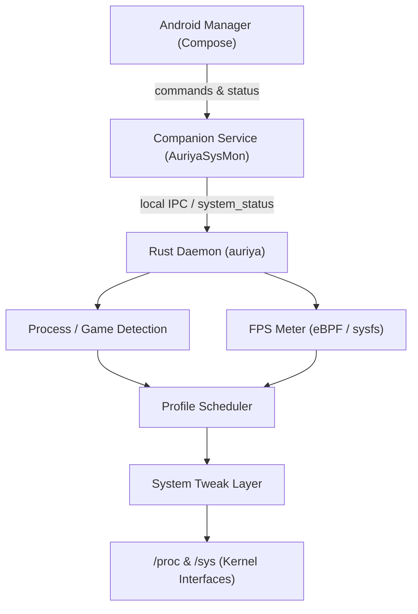
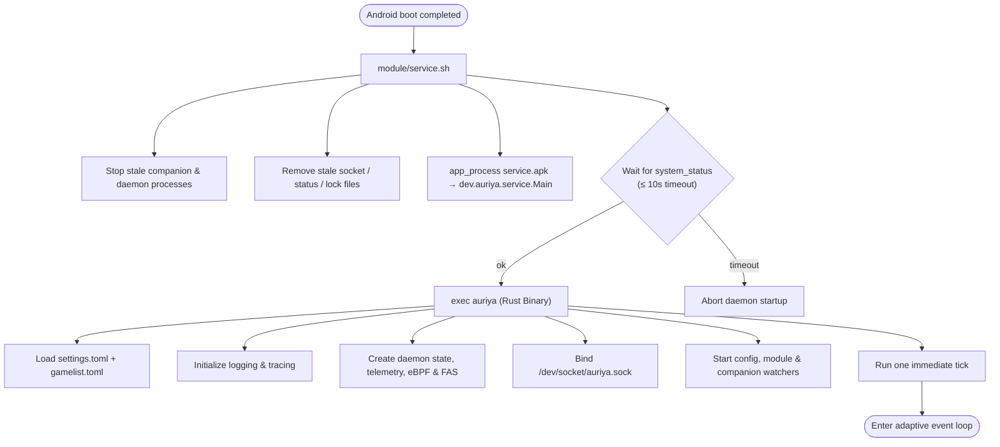
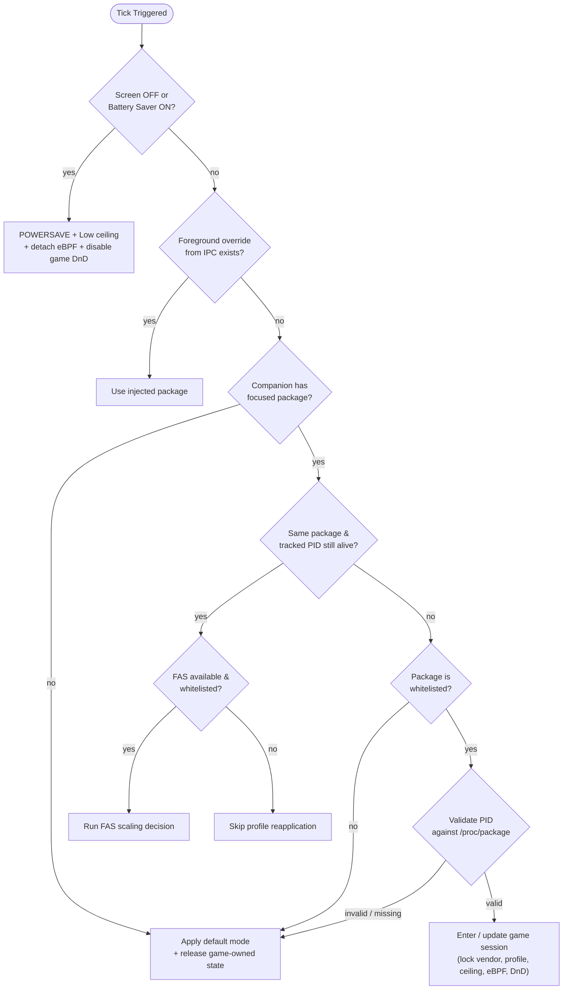

Auriya adalah modul performa Android berbasis root yang terdiri dari tiga lapisan runtime: aplikasi manajer berbasis Jetpack Compose, Android companion service, dan daemon Rust (aarch64). Daemon bertindak sebagai pemilik pemantauan sistem, transisi profil, telemetri, dan penulisan ke `/proc`/`sys`; komponen Android menangani integrasi siklus hidup sistem dan antarmuka kontrol pengguna.

Aplikasi Android manajer mengelola interaksi pengguna dan UI. Companion service menjembatani batasan siklus hidup Android. Daemon Rust mengelola pemantauan jangka panjang, penjadwalan, telemetri, dan modifikasi kernel.

CLI kontrol di `src/ctl.rs` menyediakan titik masuk kedua untuk memeriksa atau mengendalikan daemon tanpa melalui UI Compose.

## Alur Eksekusi Binary

Modul yang terinstal tidak menjalankan daemon melalui aplikasi Android. Saat boot, `module/service.sh` menunggu sinyal `sys.boot_completed` Android, menjalankan APK companion via `app_process`, menunggu hingga 10 detik file `/data/adb/.config/auriya/system_status`, lalu mengeksekusi `/data/adb/modules/auriya/system/bin/auriya` dengan jalur file settings dan gamelist yang terpasang. Log standar dialirkan ke logcat dan `/data/adb/auriya/daemon.log`. Lihat [siklus hidup modul](module-lifecycle) untuk jalur instalasi.

Titik masuk Rust memuat kedua file konfigurasi sebelum menginisialisasi tracing; kesalahan parsing akan membatalkan start daemon demi keamanan ([`main`](https://github.com/pavelc4/auriya/blob/10fe7c6b56474a00513fec34ebac1376b30e95e6/src/main.rs#L8-L49)). `run_with_config` menolak untuk melanjutkan jika file status companion tidak terisi dalam 10 detik. Kegagalan membaca mode tampilan bukan merupakan kesalahan fatal dan hanya menghasilkan daftar mode kosong ([`run_with_config`](https://github.com/pavelc4/auriya/blob/10fe7c6b56474a00513fec34ebac1376b30e95e6/src/daemon/run.rs#L574-L607)).

## Event Loop dan Irama Eksekusi

Daemon menggunakan runtime Tokio single-thread untuk orkestrasi, ditambah thread/task latar belakang untuk watcher, eBPF, dan operasi I/O perangkat. Setelah satu tick awal, `tokio::select!` menunggu event pertama yang tersedia ([event loop](https://github.com/pavelc4/auriya/blob/10fe7c6b56474a00513fec34ebac1376b30e95e6/src/daemon/run.rs#L624-L681)):

| Event | Hasil / Tindakan |
| --- | --- |
| timer | Menjalankan tick setiap 500 ms saat sesi game tervalidasi, 5 detik dalam kondisi normal, atau 10 detik saat layar mati / hemat daya aktif |
| pembaruan status companion | Menjalankan tick instan; tanpa jeda timer |
| pembaruan settings | Memuat ulang governor default/mode default; menerapkan ulang governor seketika hanya jika profil aktif adalah Balance |
| pembaruan gamelist | Membangun ulang whitelist, membersihkan paket/PID yang dilacak, lalu menjalankan tick instan |
| PID yang dilacak keluar | Menjalankan tick instan |
| pelepasan lock companion | Menandai companion mati dan mencoba me-restart dengan pembatasan frekuensi (rate-limited) |
| pembaruan modul bertahap atau Ctrl-C | Melepas lock vendor dan batas frekuensi (ceiling), lalu keluar secara bersih |

Kesalahan tick tidak menghentikan event loop. Kesalahan yang sama di-debounce pada log selama 30 detik; tick yang berhasil memperbarui status IPC bersama dengan informasi paket, PID, profil, status daya, sumber/nilai FPS, serta telemetri CPU/GPU/termal ([`Daemon::tick`](https://github.com/pavelc4/auriya/blob/10fe7c6b56474a00513fec34ebac1376b30e95e6/src/daemon/tick.rs#L24-L88)).

## Alur Pengambilan Keputusan Profil

Penjadwal profil mengevaluasi kondisi berdasarkan urutan prioritas yang ketat. Percabangan di bawahnya tidak akan dievaluasi setelah cabang yang lebih tinggi mengembalikan hasil.

Urutan ini diimplementasikan oleh `Daemon::process_tick_logic` ([sumber](https://github.com/pavelc4/auriya/blob/10fe7c6b56474a00513fec34ebac1376b30e95e6/src/daemon/tick.rs#L91-L192)). Kondisi layar mati atau penghemat daya selalu memiliki prioritas tertinggi, meskipun game tetap berada di latar depan. Daemon hanya memanggil penerapan profil lengkap jika `last.profile_mode` berbeda dari mode target; tick berulang tidak menulis ulang seluruh node kernel.

### Memasuki Game yang Terdaftar (Whitelisted)

`handle_whitelisted_app` memvalidasi PID yang fokus sebelum menerapkan status game ([sumber](https://github.com/pavelc4/auriya/blob/10fe7c6b56474a00513fec34ebac1376b30e95e6/src/daemon/tick.rs#L194-L307)). Pada sesi game baru, daemon akan:

1. Mengunci kontrol vendor agar service vendor eksternal tidak dapat langsung menimpa nilai Auriya.
2. Mengirim siaran broadcast `dev.auriya.app.ACTION_SHOW_TOAST` berisi mode terpilih.
3. Membaca profil game. Jika `mode` tidak diisi atau tidak dikenal, defaultnya adalah Performance; nilai yang valid adalah `performance`, `balance`, dan `powersave`.
4. Menerapkan profil target hanya jika berbeda dengan mode yang sedang aktif.
5. Menerapkan override batas atas (ceiling) frekuensi game, atau batas atas default yang dikonfigurasi jika tidak ada override khusus.
6. Meminta refresh rate yang dikonfigurasi jika berbeda dari override aktif.
7. Memasang probe frame eBPF Kala pada PID game yang tervalidasi.
8. Meminta mode Priority DnD jika `enable_dnd=true`, atau notifikasi normal/All jika false.
9. Menyimpan nama paket dan membuat pelacak PID (PID tracker).

Jika validasi PID gagal, daemon tidak akan menerapkan profil game; sistem langsung beralih ke mode default yang dikonfigurasi dan membersihkan status khusus game.

### Perubahan yang Dilakukan oleh Setiap Profil Statis

Berikut adalah tindakan langsung pada `src/core/profile.rs`; modul tweak masing-masing menentukan apakah jalur perangkat (/sys atau /proc) tersebut tersedia:

| Profil | Tindakan yang Dijalankan |
| --- | --- |
| Performance | Mengatur CPU governor yang diminta, mengaktifkan CPU boost, meng-online-kan core, menerapkan hook performa MediaTek/Snapdragon, mengatur mode performa GPU, mengaktifkan mode game sentuhan (touch), menerapkan tweak umum/scheduler/storage/memori, membersihkan cache (drop caches), dan opsional mengatur afinitas/prioritas CPU game |
| Balance | Mengatur governor yang dikonfigurasi, menonaktifkan CPU boost, memulihkan mode normal vendor, mengatur mode seimbang GPU, menonaktifkan mode game sentuhan, memulihkan setelan default scheduler/storage/memori |
| Powersave | Mengatur CPU governor ke `powersave` dan meminta nilai swappiness `60`; profil ini tidak menjalankan urutan pemulihan Balance terlebih dahulu |

Operasi fatal beroperator `?` mengembalikan error dan daemon membiarkan `last.profile_mode` tidak berubah. Operasi yang dibungkus dengan `warn_on_err` mencatat peringatan log tetapi tetap mengizinkan pemanggilan profil berlanjut. Mode DnD sengaja tidak diatur langsung oleh fungsi-fungsi ini; daemon menyinkronkannya dari status sesi game sehingga penurunan mode oleh FAS tidak secara keliru mengaktifkan kembali notifikasi ([fungsi profil](https://github.com/pavelc4/auriya/blob/10fe7c6b56474a00513fec34ebac1376b30e95e6/src/core/profile.rs#L96-L251)).

### Penyesuaian Dinamis FAS pada Game yang Sama

Saat paket dan PID tidak berubah, daemon menghindari logika inisialisasi ulang lengkap. Jika Frame-Aware Scheduling (FAS) aktif, sistem akan membaca stream frame Kala bersama dan memilih salah satu `ScalingAction` ([`run_fas_tick`](https://github.com/pavelc4/auriya/blob/10fe7c6b56474a00513fec34ebac1376b30e95e6/src/daemon/tick.rs#L442-L515)):

| Aksi FAS | Perubahan yang Diterapkan |
| --- | --- |
| `BoostGpu` | Hanya mode performa GPU; setelan CPU tetap tidak diubah |
| `BoostCpu` | Governor game, CPU boost, online core, scheduler performa, afinitas/prioritas proses; GPU diatur ke mode seimbang |
| `BoostBalanced` | Profil Performance penuh kecuali jika sudah berstatus Performance |
| `Maintain` | Tidak ada penulisan ke node sistem |
| `Reduce` | Kembali ke `daemon.default_mode` kecuali jika sudah berada di mode tersebut |

Error pada FAS dicatat sebagai peringatan dan tidak menghentikan loop tick. Metode pengukuran eBPF serta batasannya didokumentasikan di [probe frame eBPF Kala](../internals/kala-research).

### Keluar dari Game atau Kehilangan Status Foreground

Untuk paket yang tidak terdaftar di whitelist, PID tidak valid/hilang, atau saat tidak ada paket foreground, daemon menerapkan `daemon.default_mode` hanya jika diperlukan, memulihkan batas frekuensi default, melepas eBPF, meminta notifikasi normal, membersihkan pelacak PID, membuka kunci kontrol vendor, dan melepaskan override refresh-rate dengan meminta `0` Hz ([alur pembersihan](https://github.com/pavelc4/auriya/blob/10fe7c6b56474a00513fec34ebac1376b30e95e6/src/daemon/tick.rs#L309-L440)).

## Jalur Kontrol dan Status

`auriyactl` dan klien Android terhubung melalui `/dev/socket/auriya.sock`; keduanya tidak memanggil fungsi profil secara langsung. Handler IPC menguraikan perintah, lalu beroperasi pada status daemon atau memanggil fungsi profil yang diserialisasi. Status yang berasal dari companion mengalir ke arah sebaliknya melalui `/data/adb/.config/auriya/system_status`. Permintaan layar dan DnD umumnya diteruskan melalui command writer companion; jika companion dianggap mati, pengaturan refresh rate dan mode Zen menggunakan fallback Android `settings put`. Lihat [protokol IPC](../internals/ipc-protocol) dan [referensi sistem file](../reference/filesystem).

## Batasan Runtime (Runtime Boundaries)

- **Aplikasi Manajer (`android/app`)**: Antarmuka Compose UI, pengeditan settings/gamelist, akses root shell, widget, quick settings tile, overlay, serta penyajian status live.
- **Kotlin Bersama (`android/shared`)**: Model data dan parser TOML untuk `Settings`, `GameProfile`, `SystemStatus`, serta format transfer perintah/status.
- **Companion Service (`android/service`)**: Sensor status foreground/task-stack, daya, dan Zen/DnD; menulis snapshot status ke daemon dan menerima perintah daemon untuk aksi layar/DnD.
- **Daemon Rust (`src/main.rs`, `src/daemon`)**: Memuat konfigurasi, memulai event/tick loop, melayani `/dev/socket/auriya.sock`, mendeteksi PID foreground, mengambil sampel FPS/telemetri, memilih profil, dan menerapkan tweak.
- **CLI Rust (`src/ctl.rs`, `src/cli`)**: Klien baris perintah untuk Unix socket yang sama.
- **Batas Kernel/Perangkat (`src/core/tweaks`, telemetri, eBPF)**: Pembacaan best-effort dan penulisan terproteksi ke node khusus vendor kernel.
