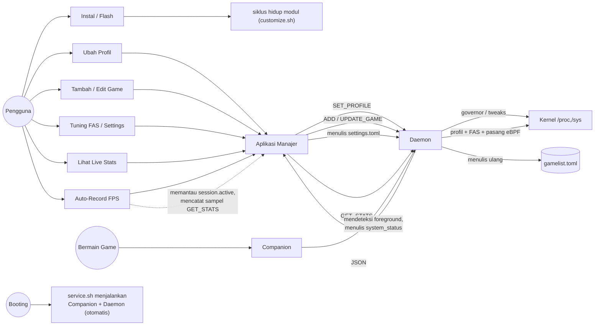

Siapa yang melakukan apa dengan Auriya, dan jalur yang dilalui oleh setiap kapabilitas di dalam sistem. Partisipan merupakan lima aktor dari [Komponen](/id/architecture/components/); setiap alur di bawah ini berpijak pada jalur runtime yang dijelaskan di [Aliran data](/id/architecture/data-flow/).

## Partisipan (Aktor)

| Aktor | Peran |
| --- | --- |
| **Pengguna** | Orang yang mengoperasikan ponsel — menginstal, mengonfigurasi, dan bermain game. |
| **Aplikasi Manajer** | Antarmuka Compose UI (`dev.auriya.app`). Menulis konfigurasi, mengirim perintah, dan merender telemetri. |
| **Companion** | Layanan `AuriyaSysMon`. Mengamati status Android dan menjalankan aksi framework. |
| **Daemon** | `auriya` (berjalan sebagai root). Bertanggung jawab atas penjadwalan, tweak sistem, IPC, dan telemetri. |
| **Kernel** | Node `/proc` + `/sys` yang dibaca/ditulis oleh daemon. |

## Peta Kasus Penggunaan (Use-Case Map)

## Alur Kasus Penggunaan

### UC-1 · Instalasi & Penggunaan Pertama
**Aktor:** Pengguna → Root Manager → `customize.sh` → Aplikasi.
1. Flash file ZIP modul; `customize.sh` memverifikasi arsitektur/checksum, menyalin APK daemon + companion, memasang aplikasi via `pm install`, dan meletakkan file default TOML.
2. Reboot ponsel. `service.sh` otomatis menjalankan companion + daemon.
3. Buka aplikasi manajer, berikan izin root. Lihat [Instalasi](/id/getting-started/installation/), [Menjalankan Pertama Kali](/id/getting-started/first-run/).

### UC-2 · Mengatur Profil Global
**Aktor:** Pengguna → Aplikasi → Daemon → Kernel.
1. Pengguna memilih profil di UI (atau melalui tile QS/widget).
2. Aplikasi mengirim: `echo 'SET_PROFILE PERFORMANCE' | nc -U …sock` (`UiViewModel.kt`).
3. Daemon mengambil lock profil, menerapkan governor/GPU/tweak → `/proc`,`/sys`.
4. Daemon membalas `OK SET_PROFILE Performance`. Lihat [IPC](/id/internals/ipc-protocol/#kontrol-profil).

### UC-3 · Menambah / Mengedit Game
**Aktor:** Pengguna → Aplikasi → Daemon → `gamelist.toml`.
1. Pengguna menambahkan paket atau mengubah override setelan pada layar Games.
2. Aplikasi mengirim `ADD_GAME <pkg>` / `UPDATE_GAME <pkg> [k=v…]`.
3. Daemon memodifikasi daftar di memori, **menulis ulang secara atomik** `gamelist.toml`, dan memperbarui whitelist. Lihat [gamelist](/id/reference/gamelist/#bagaimana-entri-ditambahkan-dan-diubah).

### UC-4 · Tuning FAS / Pengaturan
**Aktor:** Pengguna → Aplikasi → `settings.toml` → Daemon.
1. Pengguna mengubah pengaturan di dalam aplikasi (disarankan — tanpa edit manual file teks; lihat [Konfigurasi](/id/getting-started/configuration/)).
2. Aplikasi menulis ke `settings.toml`. Kunci live (`cpu.default_governor`, `daemon.default_mode`, `check_interval_ms`) langsung diterapkan saat dimuat ulang; kunci FAS berlaku setelah restart daemon. Lihat [Tuning Performa](/id/getting-started/performance-tuning/).

### UC-5 · Bermain Game (Otomatis, Tanpa Tindakan Pengguna)
**Aktor:** Companion → Daemon → Kernel.
1. Game masuk ke latar depan (foreground); companion menulis file `system_status`.
2. Watcher daemon memicu tick instan; jika paket terdaftar di whitelist dengan PID aktif, daemon memulai sesi game: mengunci node vendor, menerapkan profil game, memasang probe frame eBPF, serta meminta mode DnD/refresh rate via `auriya_cmd`.
3. Setiap tick FAS membaca frame dan menyesuaikan frekuensi CPU/GPU. Saat keluar dari game, status dibersihkan dan profil default dipulihkan. Lihat [Penjadwal profil](/id/internals/profile-scheduler/), [Deteksi game](/id/internals/game-detection/).

### UC-6 · Melihat Telemetri Live
**Aktor:** Pengguna → Aplikasi → Daemon.
1. Aplikasi membuka layar statistik dan melakukan polling `GET_STATS` (~1 Hz via root `nc`).
2. Daemon menghitung statistik FPS dari buffer FAS + snapshot baterai, lalu mengembalikan data JSON terstruktur.
3. Aplikasi merender kartu metrik secara real-time. Field `fps` bernilai `null` jika tidak ada game yang berjalan. Lihat [API Stats](/id/reference/stats-api/).

### UC-7 · Auto-Record FPS Per-Game (Sisi Aplikasi)
**Aktor:** Aplikasi (Foreground Service) didorong oleh sinyal daemon.
1. Pengguna mengaktifkan auto-record untuk game yang ada di whitelist (preferensi aplikasi).
2. Aplikasi memantau nilai `session.active` dari `GET_STATS`; saat transisi `false → true` untuk game tersebut, aplikasi mulai mengumpulkan sampel polling, dan menyelesaikan rekaman sesi saat `true → false`.
3. Hasil rekaman disimpan di sandbox lokal aplikasi. Daemon menyediakan *sinyal* (`session.active`) dan *data* (`GET_STATS`); logika pencatatan berada di sisi aplikasi — lihat [API Stats → auto-record](/id/reference/stats-api/#auto-record-fps-di-sisi-aplikasi).

## Lihat Juga

- [Aliran data](/id/architecture/data-flow/) — saluran komunikasi yang dilewati oleh alur ini.
- [Model data](/id/architecture/data-model/) — entitas data yang dipindahkan.
- [Komponen](/id/architecture/components/) — aktor-aktor sistem secara mendalam.
