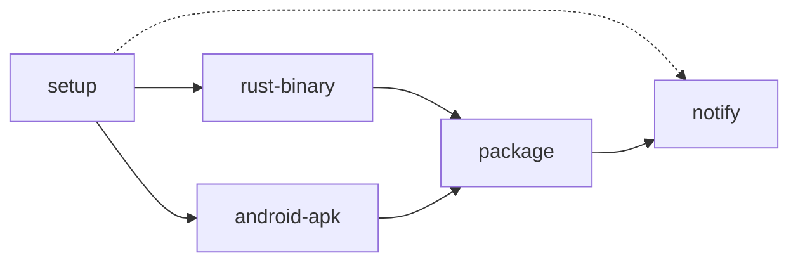
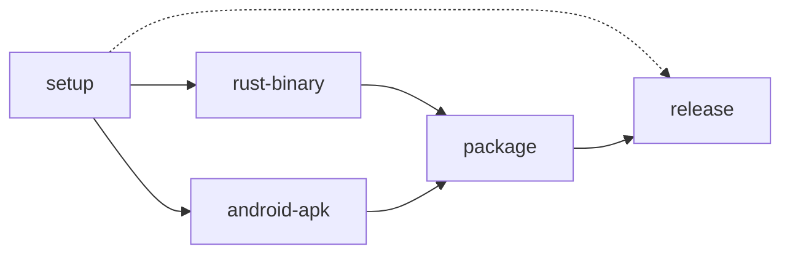

Diverifikasi langsung terhadap commit Auriya `10fe7c6b56474a00513fec34ebac1376b30e95e6`.

## Daftar Workflow

| File | Pemicu (Trigger) |
| --- | --- |
| `.github/workflows/build.yml` | `workflow_dispatch` (manual saja). |
| `.github/workflows/release.yml` | Push tag yang cocok dengan `v*`, atau `workflow_dispatch`. |

## Aksi Komposit Bersama (Shared Composite Actions)

### `setup-tools`
Menyiapkan toolchain secara otomatis ([sumber](https://github.com/pavelc4/auriya/blob/10fe7c6b56474a00513fec34ebac1376b30e95e6/.github/actions/setup-tools/action.yml)):
1. Java 26 via Temurin.
2. Android NDK r29 ditambahkan ke `PATH`.
3. Rust nightly dengan target `aarch64-linux-android` dan komponen `rust-src`.
4. Instalasi `cargo-ndk`, `p7zip-full`, dan `zstd`.

### `package-module`
Membangun file ZIP modul Magisk/KSU ([sumber](https://github.com/pavelc4/auriya/blob/10fe7c6b56474a00513fec34ebac1376b30e95e6/.github/actions/package-module/action.yml)):
1. Menyiapkan staging `build/release/module`.
2. Menyalin skrip modul, `settings.toml`, dan `gamelist.toml`.
3. Mengemas APK manajer dan service ke `libs/companion/`.
4. Mengemas binary `auriya` dan `auriyactl` ke `libs/aarch64/` beserta `checksums.sha256`.
5. Memperbarui versi pada `module.prop` dan membuat file ZIP dengan kompresi 7-Zip maksimal (`7z a -tzip -mm=Deflate -mx=9`).

### `telegram-notify`
Mengirim notifikasi progres build atau rilis dokumen ke bot Telegram ([sumber](https://github.com/pavelc4/auriya/blob/10fe7c6b56474a00513fec34ebac1376b30e95e6/.github/actions/telegram-notify/action.yml)).

## Alur Kerja `build.yml`

- `rust-binary` dan `android-apk` berjalan secara paralel setelah `setup`.
- `package` menggabungkan binary dan APK menjadi file ZIP bertipe `debug`.
- `notify` mengirim hasil build ke Telegram jika variabel bot dikonfigurasi.

## Alur Kerja `release.yml`

- Mengompilasi binary dan APK bertipe `release`.
- Membuat GitHub Release publik dan mengunggah aset ZIP.
- Memperbarui `update.json` dengan `versionCode` terbaru dan melakukan push langsung ke branch `main`.
- Mengirim file ZIP dan changelog rilis ke Telegram.
