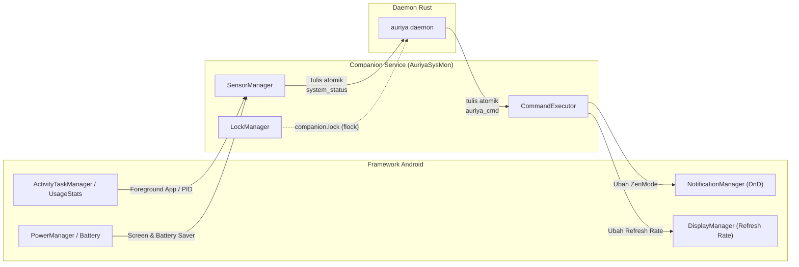

Companion service adalah proses service Android mandiri tanpa antarmuka (`AuriyaSysMon`, dijalankan via `app_process dev.auriya.service.Main`) yang menjembatani framework Android dan daemon Rust. Dokumen ini menjelaskan sensor (yang menulis `system_status`), aktuator (yang mengeksekusi `auriya_cmd`), pelacakan keaktifan (liveness tracking), serta mekanisme I/O file atomik.

:::info Diverifikasi langsung terhadap kode sumber
Dilacak ke commit `10fe7c6`: `android/service/src/main/kotlin/dev/auriya/service/` (`Main.kt`, `SensorManager.kt`, `CommandExecutor.kt`, `LockManager.kt`, `AtomicFileWriter.kt`).
:::

## Peran & Tanggung Jawab

Daemon root tidak dapat memanggil API framework Android secara langsung tanpa overhead runtime JVM. Companion berjalan dengan UID root tetapi memiliki akses penuh ke API framework Android:



## 1. Sensor: Pengamatan Status Android

`SensorManager.kt` mengamati empat metrik utama dan menulisnya ke file `/data/adb/.config/auriya/system_status`:

1. **Aplikasi Latar Depan (Foreground App & PID)**: Menggunakan polling berkala atau callback listener `IActivityTaskManager` untuk mendeteksi paket aktif dan PID-nya.
2. **Status Layar (Screen Awake)**: Mendeteksi apakah layar menyala (`PowerManager.isInteractive()`).
3. **Penghemat Baterai (Battery Saver)**: Mendeteksi apakah mode penghemat daya Android aktif (`PowerManager.isPowerSaveMode()`).
4. **Mode Zen / DnD**: Membaca status filter interupsi saat ini (`NotificationManager.getCurrentInterruptionFilter()`).

Format baris teks di `system_status`:
```text
focused_app com.miHoYo.GenshinImpact 12345 10234
screen_awake 1
battery_saver 0
zen_mode 0
```

## 2. Aktuator: Eksekusi Perintah Daemon

`CommandExecutor.kt` memantau file `/data/adb/.config/auriya/auriya_cmd` menggunakan `FileObserver` (inotify) dan mengeksekusi perubahan framework:

- **Do Not Disturb (DnD)**:
  - `dnd 1` → Mengaktifkan mode Prioritas (`INTERRUPTION_FILTER_PRIORITY`).
  - `dnd 0` → Memulihkan mode Normal / Semua Notifikasi (`INTERRUPTION_FILTER_ALL`).
- **Refresh Rate**:
  - `refresh_rate <Hz>` → Mengatur batas mode tampilan melalui Display Manager atau properti `SurfaceFlinger`.
  - `refresh_rate 0` → Mengembalikan refresh rate ke preferensi default sistem.

Format baris `auriya_cmd`:
```text
seq 104
dnd 1
refresh_rate 120
```

Field `seq` (sequence counter) digunakan untuk deduplikasi agar perintah yang sama tidak dieksekusi berulang kali.

## 3. Pelacakan Keaktifan (Liveness Tracking)

Companion mengunci file eksklusif `/data/adb/.config/auriya/companion.lock` menggunakan mekanisme `flock` Linux (`LockManager.kt`).

- Selama companion hidup, lock file tetap dipegang.
- Jika companion crash atau dimatikan oleh sistem Android, kernel secara otomatis melepaskan lock file tersebut.
- Daemon yang memantau lock file akan langsung mengetahui bahwa companion telah mati, lalu mengaktifkan fallback `settings put` dan mencoba me-restart companion dengan pembatasan frekuensi (rate limiting).

## 4. I/O File Atomik

Untuk mencegah kondisi balapan (race conditions) saat file sedang ditulis dan dibaca secara bersamaan:
- Companion dan Daemon selalu menulis ke file sementara terlebih dahulu (misalnya `.system_status.tmp` atau `.auriya_cmd.tmp`).
- Setelah penulisan dan flush selesai, file di-rename secara atomik menggunakan syscall `rename()` ke nama target akhir (`system_status` atau `auriya_cmd`).
- Hal ini menjamin bahwa watcher inotify hanya membaca file yang utuh dan valid.
