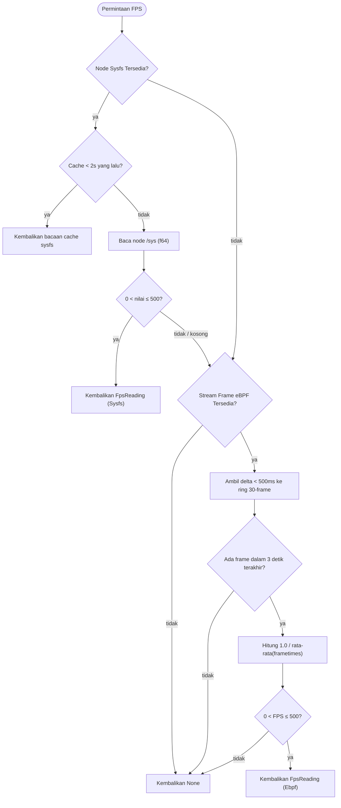

Auriya melaporkan nilai frame-per-second (FPS) dalam status daemon dan, saat Frame-Aware Scheduling (FAS) aktif, menyuplai data frame ke penjadwal. **Observasi** FPS dan **kontrol** FAS dipisahkan: halaman ini membahas observasi (`src/core/fps_meter/mod.rs`); FAS didokumentasikan di [Probe frame eBPF Kala](/id/internals/kala-research/) dan [Penjadwal profil](/id/internals/profile-scheduler/).

:::info Diverifikasi langsung terhadap kode sumber
Dilacak ke commit Auriya [`10fe7c6`](https://github.com/pavelc4/auriya/tree/10fe7c6b56474a00513fec34ebac1376b30e95e6), [`src/core/fps_meter/mod.rs`](https://github.com/pavelc4/auriya/blob/10fe7c6b56474a00513fec34ebac1376b30e95e6/src/core/fps_meter/mod.rs).
:::

## Dua Sumber Data, Sysfs Utama

`FpsMeter::read` mencoba membaca dari **sysfs** terlebih dahulu, dan hanya beralih ke delta frame **eBPF** jika sysfs tidak menghasilkan nilai apa pun (`fps_meter/mod.rs`, `read()`). Sysfs lebih diutamakan karena mencerminkan laju refresh aktual dari controller layar, yang cenderung lebih stabil dibandingkan delta per-frame saat triple-buffering atau vsync lock aktif.

Setiap pembacaan menyertakan asal sumbernya:

```rust
pub enum FpsSource { Ebpf, Sysfs }
pub struct FpsReading { pub fps: f64, pub source: FpsSource }
```



Pada respons perintah `STATUS`, nilai ini muncul sebagai `FPS=<value> SOURCE=<ebpf|sysfs>` (lihat [Protokol IPC → STATUS](/id/internals/ipc-protocol/#respons-status)).

## Sumber Sysfs

Saat inisialisasi, `detect_sysfs()` memeriksa daftar node berurutan berikut dan memilih jalur **pertama** yang ada dan tidak kosong (`FPS_SYSFS_PATHS`, `fps_meter/mod.rs`):

```text
/sys/class/drm/sde-crtc-0/measured_fps
/sys/class/drm/card0/sde-crtc-0/measured_fps
/sys/class/drm/card0/sde_crtc_fps
/sys/class/drm/card0/fbc/fps
/sys/class/graphics/fb0/measured_fps
/sys/class/graphics/fb0/fps
/sys/kernel/debug/mali/fps
/sys/class/misc/mali0/device/fps
```

Enam jalur pertama adalah node display controller dan framebuffer Qualcomm/DRM; dua jalur terakhir adalah node GPU Mali (ARM). Jika tidak ada yang cocok, meter sepenuhnya mengandalkan eBPF.

Perilaku (`read_sysfs`):
- Di-polling paling sering setiap **2 detik** (`SYSFS_POLL_INTERVAL`); di antara jeda polling, pembacaan terakhir dikembalikan dari cache memori.
- File diparsing sebagai `f64`; nilai di luar rentang `(0, 500]` ditolak (mengembalikan `None`), melindungi dari data sampah atau pembacaan `0` saat panel layar diam (idle).

## Fallback eBPF

Digunakan hanya jika sysfs tidak menghasilkan data. Durasi waktu frame masuk melalui `broadcast::Receiver<Duration>` dari stream frame Kala (lihat [Probe frame eBPF Kala → Integrasi Auriya](/id/internals/kala-research/#integrasi-auriya)). `drain_ebpf` + `read` (`fps_meter/mod.rs`):

- Setiap delta waktu frame hanya dipertahankan jika **< 500 ms** (`Duration::from_millis(500)`); jeda yang lebih besar (misalnya saat aplikasi berhenti merender) akan dibuang.
- Delta yang valid disimpan dalam ring buffer **30-frame** (`SHORT_WINDOW`, ≈ ½ detik pada 60 fps); nilai FPS dihitung dengan rumus `1.0 / mean(frametimes)`.
- Jika tidak ada frame baru yang masuk selama **3 detik** (`ebpf_timeout`), atau ring buffer kosong, `read` mengembalikan `None`.
- Nilai FPS yang dihitung juga dibatasi oleh batas validitas `(0, 500]`.
- Penerimaan yang tertinggal (`TryRecvError::Lagged`) dicatat ke log dan dilewati; channel yang tertutup akan menonaktifkan sumber eBPF untuk seterusnya.

## Dampak & Karakteristik

- **Ketersediaan FAS tidak membatasi pelaporan FPS status.** Meskipun program eBPF tidak dapat dipasang (misalnya karena kernel lama atau simbol hilang), FPS dari sysfs tetap dapat mengisi status daemon.
- Meter ini tidak pernah memblokir thread: sysfs dibatasi dengan cache, dan antrean eBPF dikosongkan secara non-blocking. Tick yang tidak menemukan sumber apa pun hanya melaporkan ketiadaan FPS.
- Nilai eBPF di sini adalah laju **frame-submission** yang dihitung dari delta hook `queueBuffer`, bukan timestamp tampilan fisik pada layar — lihat batasan pada [Probe frame eBPF Kala → Cakupan dan Batasan](/id/internals/kala-research/#cakupan-dan-batasan).
