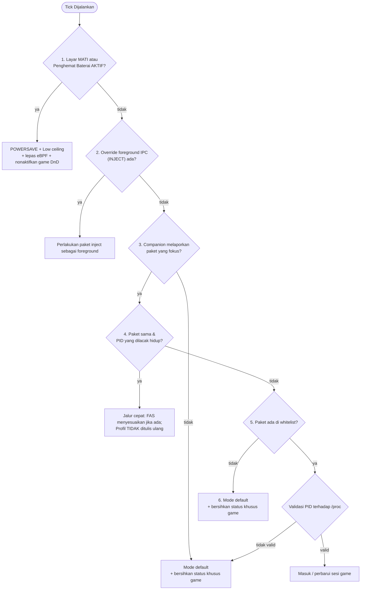

Penjadwal (Profile Scheduler) adalah inti logika keputusan daemon: satu kali pada setiap tick, ia menentukan profil performa mana yang harus aktif pada perangkat dan menerapkannya. Halaman ini mendokumentasikan fungsi keputusan; untuk gambaran **tingkat sistem** dan tabel yang menjelaskan apa yang ditulis oleh setiap profil, lihat [Ringkasan arsitektur](/id/architecture/overview/#alur-pengambilan-keputusan-profil).

:::info Diverifikasi langsung terhadap kode sumber
Dilacak ke commit Auriya [`10fe7c6`](https://github.com/pavelc4/auriya/tree/10fe7c6b56474a00513fec34ebac1376b30e95e6), [`src/daemon/tick.rs`](https://github.com/pavelc4/auriya/blob/10fe7c6b56474a00513fec34ebac1376b30e95e6/src/daemon/tick.rs) dan [`src/daemon/run.rs`](https://github.com/pavelc4/auriya/blob/10fe7c6b56474a00513fec34ebac1376b30e95e6/src/daemon/run.rs).
:::

## Urutan Pengambilan Keputusan

`Daemon::process_tick_logic` (`tick.rs:91-192`) mengevaluasi kondisi berdasarkan **urutan prioritas yang ketat**; percabangan pertama yang cocok akan dieksekusi dan cabang di bawahnya tidak akan dijalankan:

Pemeriksaan layar mati / penghemat baterai dilakukan pertama kali tanpa syarat, sehingga selalu diprioritaskan bahkan saat game masih berada di latar depan.

## Perlindungan Idempotensi (Idempotence Guard)

Profil hanya diterapkan (ulang) jika profil target berbeda dari yang sedang aktif di kernel: `if self.last.profile_mode != Some(target_mode)` (`tick.rs:260`). Oleh karena itu, tick yang berjalan berulang kali dalam kondisi kondisi stabil **tidak** menulis ulang node kernel — tick tanpa perubahan status tidak akan melakukan penulisan I/O perangkat.

## Memasuki Game yang Ada di Whitelist

Saat cabang 5 memvalidasi PID yang hidup, `handle_whitelisted_app` (`tick.rs:194-307`) menjalankan inisialisasi sesi game:
1. **Resolusi Mode**: Bersifat case-insensitive dengan default Performance. `powersave` → Powersave, `balance` → Balance, `fast` → Fast, **nilai lain atau tidak diisi → Performance** (`tick.rs`).
2. **Fallback Governor**: Jika `cpu_governor` per-game kosong, sistem menggunakan `balance_governor` global (`tick.rs`).
3. **Batas Frekuensi (Ceiling)**: Jika format `ceiling` tidak dapat diparsing, sistem mengabaikannya tanpa error (`tick.rs`).
4. **Refresh Rate**: Hanya diminta jika berbeda dari refresh rate yang sedang aktif, dan dilepaskan (meminta `0`) saat keluar dari sesi game.

Tabel tindakan yang ditulis setiap profil dapat dilihat di [Ringkasan arsitektur → Perubahan statis setiap profil](/id/architecture/overview/#perubahan-yang-dilakukan-oleh-setiap-profil-statis).

## Penyesuaian FAS dalam Sesi Game

Pada jalur cepat (cabang 4), jika FAS aktif, algoritma membaca stream frame Kala dan memilih satu aksi penskalaan per tick (`BoostGpu`, `BoostCpu`, `BoostBalanced`, `Maintain`, `Reduce`). Rincian pemetaan aksi FAS dijelaskan di [Ringkasan arsitektur → Penyesuaian Dinamis FAS](/id/architecture/overview/#penyesuaian-dinamis-fas-pada-game-yang-sama).

## Keluar dari Game / Tanpa Foreground

Fungsi pembersihan (`apply_balance_and_clear`, `tick.rs`) menerapkan `daemon.default_mode` jika berbeda dari mode saat ini, memulihkan batas frekuensi default, melepas eBPF, mengembalikan mode notifikasi normal (DnD All), melepas override refresh rate (meminta `0`), membuka kunci kontrol vendor, dan menghapus pelacak PID.

## File `current_profile`

Setiap kali profil berganti, daemon menulis digit identifikasi ke `/data/adb/.config/auriya/current_profile` (`update_current_profile_file`, `run.rs`):
- `1` → Performance
- `2` → Balance
- `3` → Powersave
- `4` → Fast

File ini disediakan untuk kompatibilitas script eksternal dan bukan status utama UI (status utama diperoleh via IPC).

## Penanganan Error

Kegagalan penerapan profil dicatat ke log error dan membiarkan `last.profile_mode` tidak berubah agar tick berikutnya mencoba kembali (`tick.rs:274-279`). Error tidak menghentikan loop event daemon.
