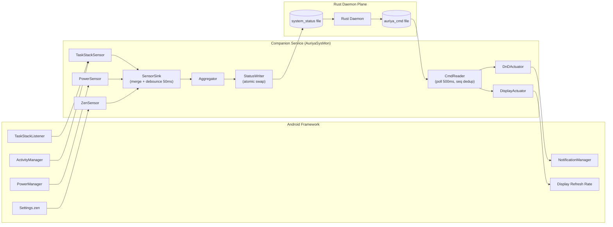

The companion (`AuriyaSysMon`) is the Android half of Auriya. The root daemon
cannot call Android framework APIs — it is a plain root binary, not an app — so a
second process runs as an Android app with root uid to do two things the daemon
can't: **observe** Android state (foreground app, screen, battery-saver, Zen) and
**actuate** framework settings (Do-Not-Disturb, refresh rate). It exchanges both
with the daemon through files, never a socket.

:::info Verified against source
`android/service/src/main/kotlin/dev/auriya/service/` — `Main.kt`, `sensor/`,
`actuator/`, `io/`, `lock/`. Launched by `module/service.sh`.
:::

## Why it exists

| Need | Daemon (root binary) | Companion (root-uid app) |
| --- | :---: | :---: |
| Read/write `/proc`, `/sys` | Yes | — |
| Detect foreground app (TaskStack/ActivityManager) | No | Yes |
| Read screen / power-save / Zen state | No | Yes |
| Set Do-Not-Disturb, refresh rate | No | Yes |

So the daemon owns kernel-level work; the companion owns framework-level work. See
[overview → runtime boundaries](../architecture/overview#runtime-boundaries).

## Launch & single-instance lock

`module/service.sh` starts it via `app_process` with `--nice-name=AuriyaSysMon`,
entry point `dev.auriya.service.Main` (inherits the system uid from the root
manager's `service.d` hook). `Main.main` (`Main.kt`):

1. Acquires an exclusive `FileLock` on `companion.lock` (`lock/LockFile.kt`). If a
   companion is already running, it **exits** rather than fighting for the lock.
2. The lock is held for the JVM's whole life; the OS releases it on exit/kill, so
   the daemon can detect a crashed companion in real time (`fcntl(F_GETLK)`), which
   drives the daemon's `companion.lock` watcher and `settings put` fallback.
3. Starts sensors + the command reader, then parks on the main `Looper`.

## Architecture

Two independent directions: **sensors → `system_status`** (observe) and
**`auriya_cmd` → actuators** (actuate). The daemon is on the other end of both
files — see [Data flow](../architecture/data-flow#the-four-channels-concretely).

## Sensors (observe → `system_status`)

Each sensor pushes a partial `SensorSnapshot` to a shared `SensorSink`; the
`Aggregator` in `Main.kt` merges snapshots and, after a 50 ms debounce, hands the
merged state to `StatusWriter`.

| Sensor | Observes | Mechanism | Cadence |
| --- | --- | --- | --- |
| `TaskStackSensor` | foreground `pkg`/`pid`/`uid` | Registers `ITaskStackListener` on `IActivityTaskManager` via binder reflection → **event-driven**; reads `getRunningAppProcesses` for the `IMPORTANCE_FOREGROUND` process | event + 1 s fallback poll |
| `PowerSensor` | `screen_awake`, `battery_saver` | `IPowerManager` reflection (`isInteractive`, `isPowerSaveMode`) | 1 s poll |
| `ZenSensor` | `zen_mode` | reads `Settings.Global zen_mode` | 1 s poll |

`TaskStackSensor` is the interesting one: it builds a `Proxy` implementing
`ITaskStackListener` and registers it, so foreground changes arrive as callbacks
(`onTaskMovedToFront`, `onTaskFocusChanged`, …) rather than polling. It requires
**Android 11+** (`Build.VERSION_CODES.R`) and falls back to a 1 s poll if binder
registration fails. It de-dupes by emitting only when the package changes.

The merged snapshot becomes `SystemStatus` (the exact fields are the
[data model](../architecture/data-model#systemstatus-companion--daemon)).

## Actuators (actuate ← `auriya_cmd`)

`CmdReader` watches the daemon's command file and dispatches each fresh `Cmd`:

| Actuator | Applies | Framework API |
| --- | --- | --- |
| `DnDActuator` | `dnd` filter (All / Priority) | `NotificationManager` interruption filter |
| `DisplayActuator` | `refresh_rate` (0 = restore) | display / `Settings` via `SettingsHelper` |

## IO: crash-safe file exchange

### `StatusWriter` — atomic writes

The daemon watches the parent dir for `IN_CLOSE_WRITE` and re-parses. To never
expose a half-written file, `StatusWriter` writes a sibling tempfile → `fsync` →
`Files.move(ATOMIC_MOVE, REPLACE_EXISTING)` (with a plain-replace fallback if the
FS rejects atomic move). The daemon therefore always reads a complete snapshot.
This mirrors the daemon's own atomic-write pattern
([CmdWriter](system-tweaks#actions-routed-through-android--cmdwriter),
[gamelist save](../reference/gamelist#persistence)).

### `CmdReader` — polling, not FileObserver

`CmdReader` polls `auriya_cmd` every **500 ms** and de-dupes on the command's
monotonic `seq` (a lower seq means the daemon restarted → still dispatched).

:::warning Why polling, not `FileObserver`
`CmdReader` **deliberately avoids** `android.os.FileObserver`: on Android 16
(API 36) the native FileObserver thread `SIGSEGV`s in `libandroid_runtime.so` when
used from a headless `app_process`, taking the whole companion down. Polling at
500 ms is invisible here — the command file changes only a handful of times per
day (`CmdReader.kt` doc comment).
:::

## Liveness

`companion.lock` (exclusive `FileLock`, held for the JVM lifetime) is both the
single-instance guard and the daemon's liveness signal: the daemon watches it and,
when the companion is considered dead, falls back to Android `settings put` for
DnD / refresh rate ([overview → control paths](../architecture/overview#control-and-status-paths)).
`service.sh` restarts a dead companion; the daemon rate-limits restart attempts.

## Shared models

The companion and the app share Kotlin models + codecs in `android/shared`
(`SystemStatus`, `Cmd`, `StatusFormat`, `CmdFormat`) — the same `android/shared`
that defines the app's config models. Wire shapes must match the daemon's Rust
structs; see [data model → config entities](../architecture/data-model#config-entities-rust--kotlin--must-stay-in-sync).

## See also

- [Data flow](../architecture/data-flow) — how `system_status` / `auriya_cmd` move.
- [Game detection](game-detection) — how the daemon consumes `focused_app`/`pid`.
- [System tweaks → CmdWriter](system-tweaks#actions-routed-through-android--cmdwriter) — the daemon's side of `auriya_cmd`.