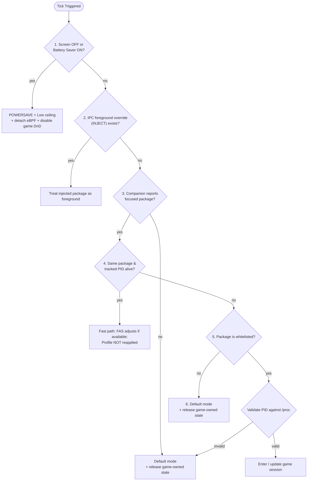

The scheduler is the daemon's decision core: once per tick it decides which
performance profile the device should be in and applies it. This page documents
the exact decision function; for the **system-level** view and the tables of what
each profile writes, see
[Architecture overview](/architecture/overview/#profile-decision-workflow) — this
page is the source-precise companion to it, not a duplicate.

:::info Verified against source
Traced to Auriya commit
[`10fe7c6`](https://github.com/pavelc4/auriya/tree/10fe7c6b56474a00513fec34ebac1376b30e95e6),
[`src/daemon/tick.rs`](https://github.com/pavelc4/auriya/blob/10fe7c6b56474a00513fec34ebac1376b30e95e6/src/daemon/tick.rs)
and
[`src/daemon/run.rs`](https://github.com/pavelc4/auriya/blob/10fe7c6b56474a00513fec34ebac1376b30e95e6/src/daemon/run.rs).
:::

## Decision order

`Daemon::process_tick_logic` (`tick.rs:91-192`) evaluates conditions in **strict
priority order**; the first matching branch wins and no lower branch runs:

Screen-off / battery-saver is checked first and unconditionally, so it wins even
while a game is foregrounded. The injected override (2) exists for debugging via
`INJECT` (see [Game detection](/internals/game-detection/#where-the-foreground-package-comes-from)).

## The idempotence guard

Profiles are only (re)applied when the target differs from what is already
active: `if self.last.profile_mode != Some(target_mode)` (`tick.rs:260`, and the
mirror check on the clear path, `tick.rs:323`). Repeated ticks in a steady state
therefore do **not** rewrite kernel nodes — a tick that changes nothing performs
no writes.

## Entering a whitelisted game

When branch 5 validates a live PID, `handle_whitelisted_app` (`tick.rs:194-307`)
runs the game-session setup. The full ordered sequence (vendor lock, toast
broadcast, mode resolution, ceiling, refresh rate, eBPF attach, DnD, PID tracker)
is enumerated in
[Architecture overview → Entering a whitelisted game](/architecture/overview/#entering-a-whitelisted-game).
Source-level specifics worth pinning here:

- **Mode resolution is case-insensitive with a Performance default.** `powersave`
  → Powersave, `balance` → Balance, `fast` → Fast, **anything else or missing → Performance**
  (`tick.rs`). A typo silently resolves to Performance.
- **Governor fallback**: an empty per-game `cpu_governor` falls back to the global
  `balance_governor` (`tick.rs`).
- **Ceiling**: an unparseable per-game `ceiling` string is dropped to
  no-override, not an error (`tick.rs`).
- **Refresh rate** is only requested when it differs from the currently applied
  rate (`tick.rs`), and released (request `0`) when leaving
  (`tick.rs`).

What each profile actually writes to the kernel is the single-source-of-truth
table in
[Architecture overview → What each static profile changes](/architecture/overview/#what-each-static-profile-changes).

## FAS adjustments within a session

On the fast path (branch 4), if Frame-Aware Scheduling exists it consumes the
Kala frame stream and picks one scaling action per tick. The action→effect
mapping (`BoostGpu`, `BoostCpu`, `BoostBalanced`, `Maintain`, `Reduce`) is
documented in
[Architecture overview → FAS dynamic changes](/architecture/overview/#fas-dynamic-changes-inside-the-same-game).
The frame-measurement mechanism itself is in
[Kala eBPF frame probe](/internals/kala-research/).

## Leaving a game / no foreground

The clear path (`apply_balance_and_clear`, `tick.rs`) applies
`daemon.default_mode` only if it differs from the current mode, then restores
default ceiling, detaches eBPF, requests normal notifications (DnD All), releases
any refresh-rate override (request `0`), unlocks vendor controls, and clears the
PID tracker.

## The `current_profile` file

On each applied profile change the daemon also writes
`/data/adb/.config/auriya/current_profile` (`update_current_profile_file`,
`run.rs`, called from `tick.rs`). It contains a single digit:

| Value | Profile |
| --- | --- |
| `1` | Performance |
| `2` | Balance |
| `3` | Powersave |
| `4` | Fast |

This is a **legacy/compatibility** status output for external readers. It is
best-effort (write failures are logged, not fatal) and is **not** the
authoritative UI state — live daemon status over IPC is. See
[Filesystem reference](/reference/filesystem/#configuration-and-runtime-state--dataadbconfigauriya).

## Error handling

A failed profile application logs an error and leaves `last.profile_mode`
unchanged, so the next tick retries (`tick.rs:274-279`, `330-335`). A tick that
errors does not terminate the loop; identical errors are debounced for 30 s (see
[Architecture overview → Event loop](/architecture/overview/#event-loop-and-execution-cadence)).

## Likely to drift first

The branch order and the mode/ceiling parsing defaults. Re-verify against
`Daemon::process_tick_logic` and `handle_whitelisted_app` in `src/daemon/tick.rs`.
